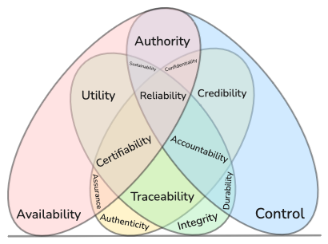

# Maturity levels in the CISQ security model

|  |
|                      :--:                    |
|  *The CISQ security model version 1.0*       |

## Introducing the model

The Composing Information Security Qualities (CISQ) model is created by combining insights and definitions from the [CIA triad](https://en.wikipedia.org/wiki/Information_security#CIA_triad), [Parkerian Hexad](https://en.wikipedia.org/wiki/Parkerian_Hexad) and [STRIDE threat model](https://en.wikipedia.org/wiki/STRIDE_model). The result is a model of four pillar security qualities and eleven composed security qualities. Each security quality has a corresponding threat category inspired by the STRIDE threat model. You can read mode about the model here; [CISQ-Model of security qualities](https://acje.github.io/CISQ-model)

The CISQ security model can be a bit daunting at first. To make the model more approachable, this document describes a step by step maturity model that introduces the model by introducing the four pillars and then building further on top of these in a systematic manner.

## Maturity level one

At the first level the four pillar qualities are evaluated in the context of the system. These qualities will be important to evaluate for any system and they make up the foundations for all the other security concepts at any maturity level.

|  |
|                      :--:                                |
|  *Maturity level one of the CISQ security model*         |

The four pillar security qualities are:

**Availability** - Timely access to information and behavior

*Corresponding threat category*: Denial of service

*Typical security controls*: Rate limiting, Traffic scrubbing, Resource pooling, input validation (ACL, WAF), load balancing

**Integrity** - Preserving correctness and completeness of information and behavior

*Corresponding threat category*: Tampering

*Typical security controls*: Input validation, Hash functions, Session management, separation of duties

**Control** - Power to physically or logically influence information and behavior

*Corresponding threat category*: Elevation of privilege

*Typical security controls*: Principle of least privilege, patch management, logging and auditing

**Authenticity** - Origin of information and behavior is from its purported source

*Corresponding threat category*: Spoofing

*Typical security controls*: Multi-Factor Authentication, signatures, certificates

## Maturity level two

At maturity level two we introduce some common higher order qualities that are composed of two or three pillar qualities from maturity level one.

|  |
|                      :--:                                |
|  *Maturity level two of the CISQ security model*         |

**Utility** - Usefulness of information and behavior

*Corresponding threat category*: Information contortion

*Typical security controls*: API management, type checks

**Confidentiality** - Access to information and behavior being exclusively limited to authorized entities

*Corresponding threat category*: Information disclosure

*Typical security controls*: Encryption, Access control lists (ACLs), Data loss prevention (DLP), data classification policies

**Accountability** - Assurance of the correctness, completeness and origin of information and behavior

*Corresponding threat category*: Non-repudiation

*Typical security controls*: Signatures, public key infrastructure (PKI), Audit trails and logs, message authentication codes (MACs), digital contracts, hashing, trusted third parties

## Maturity level three

Maturity level three is TODO.

At maturity level three we introduce more accurate definition of concepts. Increasing your depth of conceptual understanding may help develop and categorize security controls (not to be confused with the *control quality* in the CISQ model).

**Reliability** – Trustworthy information and behavior

**Sustainability** - Ability to maintain information and behavior

**Authority** - Power to grant access to information and behavior

**Durability** - Ability to withstand integrity degradation of information and behavior

**Credibility** - Verified information and behavior

**Certifiability** - Ability to prove validity of information and behavior

**Assurance** - Positive declaration of information and behavior

**Traceability** - Ability to discover where and how information and behavior was made
