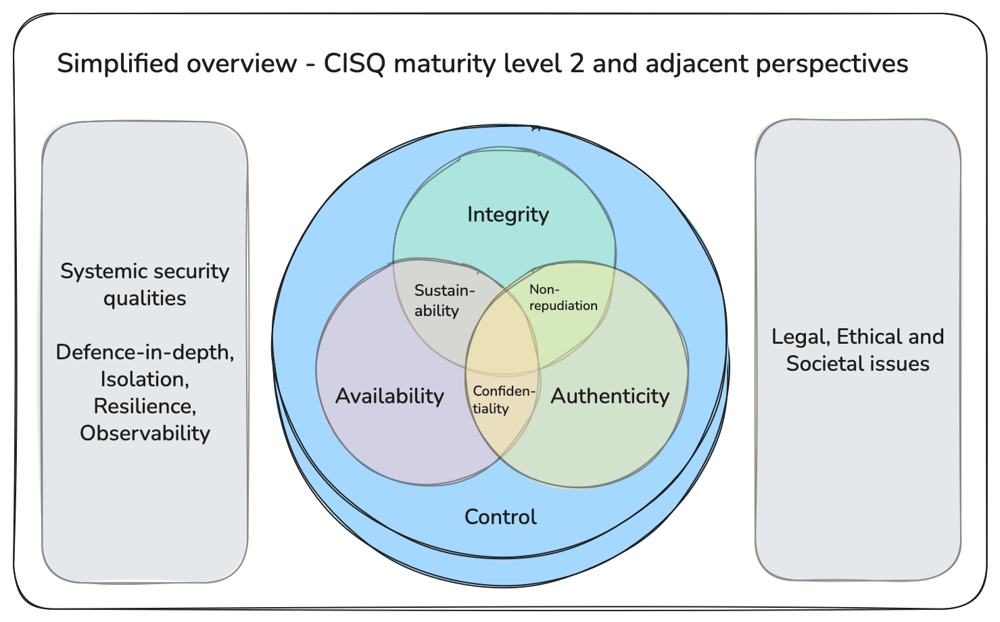
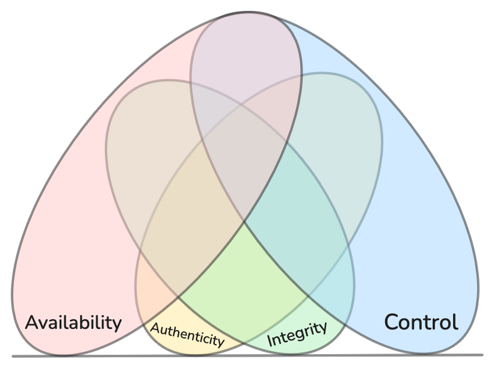
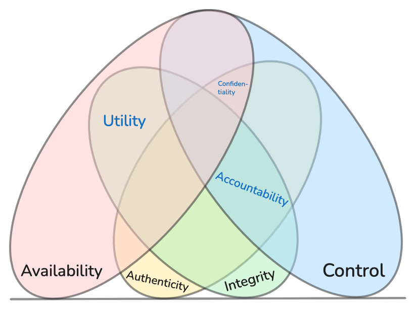
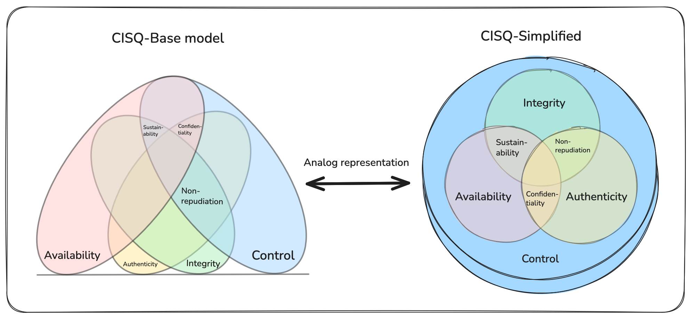
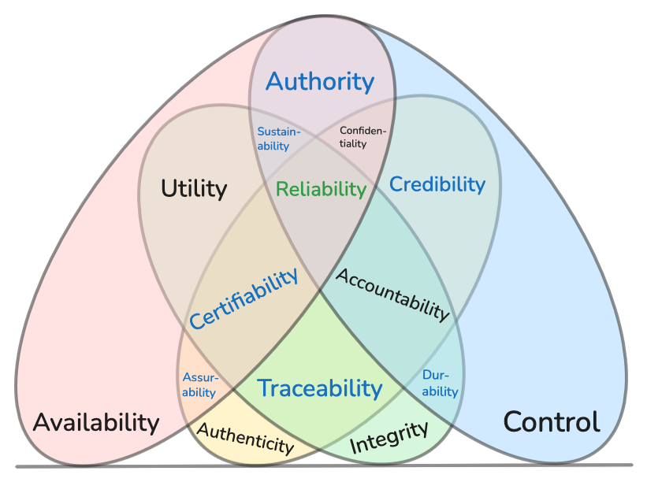
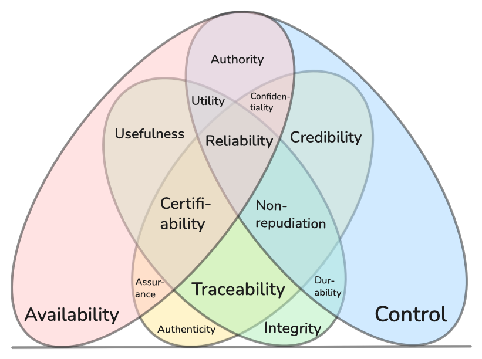

# Maturity levels in the CISQ security model

|                          |
|                      :--:                                                       |
|  *A good place to start: CISQ security model v1.0, Maturity level 2 simplified* |

## Introducing the model

The Composing Information Security Qualities (CISQ) model is created by combining insights and definitions from the [CIA triad](https://en.wikipedia.org/wiki/Information_security#CIA_triad), [Parkerian Hexad](https://en.wikipedia.org/wiki/Parkerian_Hexad), and [STRIDE threat model](https://en.wikipedia.org/wiki/STRIDE_model). The result is a model of four primary security qualities and eleven composed security qualities. Each security quality has a corresponding threat category inspired by the STRIDE threat model. You can read more about prior work on the model here: [CISQ-Model of security qualities](https://acje.github.io/CISQ-model). Please note that prior work on this model may differ somewhat from this version, as we have adopted more familiar terms for qualities and threats.

The CISQ model describes *security qualities*: positive, naturally emerging qualities we want to preserve in information objects or in the information and behavior of information systems. The CISQ model does not describe systemic qualities that emerge in the relationships between components or within systems, nor does it deal with human-made concepts like legal, ethical, or societal issues. This is why the simplified view of the CISQ model can also be flanked by these two distinct concepts, as shown below.

Together with related perspectives, this is a useful representation and starting point for most teams managing information systems. The higher maturity levels are meant for security professionals and infrastructure or platform teams focusing on a deeper understanding of their security posture.

|            |
|                      :--:                                          |
|  *CISQ security model v1.0, Maturity level 2, simplified overview* |

The CISQ security model can be a bit daunting at first. To make the model more approachable, this document presents a step-by-step maturity model, starting with the four primary qualities and then building on them in a systematic manner.

### Model concept “behavior”

Throughout this model, the phrase “information and behavior” is central. Behavior here refers to any state transitions and observable actions in an information system. The significance is that the model does not limit itself only to information; it also applies to system behavior, such as replying to a message, reading a sensor, or using an actuator.

### Model concept “composition”

> *Nature’s order is the foundation of our understanding*

A key concept in Composing Information Security Qualities (CISQ) is composition. The four primary security qualities (Availability, Integrity, Control, Authenticity) are composed to create new qualities. All 15 possible compositions are included in the model, the 16th variant the empty set, is excluded. The purpose is to achieve both completeness and non-overlapping concepts. However, this has not yet been formally proven.

Example: Non-repudiation = Control ⊕ Integrity ⊕ Authenticity.

## How to use the model

The CISQ model structures the vocabulary of security qualities. These are qualities we want to protect when working with information systems. When performing a risk assessment, as mandated by ISO/IEC 27005, the CISQ model may help when establishing the context and identifying risks. If you use threat modeling to identify risks, CISQ can replace or enhance the STRIDE model.

## Maturity level one

At the first level, the four primary qualities are evaluated in the context of the system. These qualities are important to evaluate for any system, and they form the foundation for all the other security concepts at any maturity level. Note that we refer to the *control quality* here—borrowed from the Parkerian Hexad—not to be confused with security controls.

|  |
|                      :--:                                |
|  *Maturity level one of the CISQ security model*         |

### The four primary security qualities

**Availability** – Timely access to information and behavior

Availability ensures users and systems can access information and execute required behavior when needed, despite failures, demand spikes, or maintenance. It emphasizes capacity, resilience, and graceful degradation by keeping services responsive under stress and recovering quickly when components fail. Strong availability practices combine demand forecasting and capacity planning, health checks and monitoring, redundancy and failover, load balancing and backpressure, rate limiting and circuit breakers, retry/backoff and queuing, and disaster recovery/business continuity. By preserving availability, teams minimize downtime, sustain essential operations, and maintain user trust.

*Corresponding threat category*: Denial of service — disruption or resource exhaustion preventing timely access

*Typical security controls*: Redundancy, capacity planning, load balancing

**Integrity** – Preserving correctness and completeness of information and behavior

Integrity ensures information and system behavior remain correct, complete, and unaltered from their intended state across storage, transmission, and execution. It focuses on preventing, detecting, and recovering from unauthorized or accidental changes by maintaining invariants and verifying inputs, states, and outputs. Strong integrity practices combine validation and normalization, cryptographic hashes and signatures, transactional guarantees and idempotency, and separation of duties to reduce the chance and impact of tampering. By preserving integrity, teams can trust results, reason about changes, and safely automate decisions and actions.

*Corresponding threat category*: Tampering — unauthorized modification compromising correctness or completeness

*Typical security controls*: Input validation, hashing, session management, separation of duties

**Control** – Power to physically or logically influence information and behavior

CISQ’s primary control security quality mirrors "Possession or Control" in the Parkerian Hexad. At its core, the control security quality is all about agency. It concerns the extent to which someone or something can influence an information system. This quality is also special in that it does not apply to widely dispersed information objects and, as such, creates a dichotomy in the CISQ model, with information objects not under exclusive control on one side, and information systems on the other. In modern information systems, control is often shared among other teams and organizations that together exert exclusive control. Typical situations include cloud hosting or smartphones, where manufacturers, hosting providers, operators, and users all have some degree of influence on the systems. Effectively managing control prevents unauthorized manipulation and limits the blast radius when barriers fail.

*Corresponding threat category*: Elevation of privilege — unauthorized gain of permissions enabling control, break‑glass workflows

*Typical security controls*: Principle of least privilege, patch management, logging and auditing, secure enclaves

**Authenticity** – Information and behavior originate from their purported source

Authenticity ensures information and system behavior truly originate from the claimed source and remain bound to that identity across creation, transmission, and execution. It focuses on identity proofing and binding, mutual verification, and provenance, resisting impersonation, spoofing, and forged artifacts. Strong authenticity practices combine a robust identity lifecycle (enrollment, proofing, rotation, revocation), secure channels and token binding, and tamper‑evident logs to establish source and lineage. By preserving authenticity, teams can trust who or what produced actions and data, enabling accountable automation and safe delegation.

*Corresponding threat category*: Spoofing — impersonation of identities or sources

*Typical security controls*: Multi-factor authentication (MFA), signatures, certificate management and pinning, mutual transport layer security (mTLS)

## Maturity level two

At maturity level two, we introduce some common higher-order qualities that are composed of the control quality and two of the other three primary qualities from maturity level one.

|  |
|                      :--:                                |
|  *Maturity level two of the CISQ security model*         |

Maturity level two is also represented in the simplified view.

|                                        |
|                      :--:                                                                         |
|  *The CISQ security model has a base view covering all maturity levels and a simplified overview* |

**Utility** – Ability to maintain information and behavior

Utility emphasizes maintainability, operability, and evolvability over time, favoring semantic stability, backward compatibility, and maintainable interfaces.

*Corresponding threat category*: Information contortion — distortion or incompatibility reducing ability to maintain or use

*Typical security controls*: API management, semantic versioning, type checks, independently deployable components

**Confidentiality** – Access to information and behavior is limited exclusively to authorized entities

*Corresponding threat category*: Information disclosure — unauthorized exposure of information or behavior

*Typical security controls*: Encryption, access control lists (ACLs), data loss prevention (DLP), data classification policies

**Non-repudiation** – Assurance of the correctness, completeness, and origin of information and behavior

*Corresponding threat category*: Repudiation — denial of actions or origins

*Typical security controls*: Signatures, public key infrastructure (PKI), audit trails and logs, message authentication codes (MACs), digital contracts, hashing, trusted third parties

## Maturity level three

At maturity level three, we introduce more precise definitions of concepts. Increasing your depth of conceptual understanding may help you develop and categorize security controls (not to be confused with the *control quality* in the CISQ model).

|  |
|                      :--:                                |
|  *Maturity level three of the CISQ security model*       |

**Authorization** – Power to grant access to information and behavior

*Corresponding threat category*: Broken access control — missing or incorrect checks allow unauthorized actions or data access

*Typical security controls*: Policy‑based access control (RBAC/ABAC), centralized policy engines (e.g., OPA), deny‑by‑default and least privilege, resource‑scoped checks at API/service/data layers, tenant isolation, permission boundaries/guardrails, entitlement reviews and audited authorization decisions

**Durability** – Ability to withstand degradation of the integrity of information and behavior

*Corresponding threat category*: Data corruption — integrity degradation of stored or transmitted data

*Typical security controls*: Automatic rebuilding, forward error correction (FEC), error correction codes (ECC)

**Credibility** – Ability to verify information and behavior

*Corresponding threat category*: Misinformation — deceptive or misleading content undermining verification

*Typical security controls*: Cryptographic signatures, certificate pinning, PKI validation, trusted timestamping, source verification policies, tamper-evident logging, content validation workflows, reputation/trust lists

**Certifiability** – Ability to prove the validity of information and behavior

*Corresponding threat category*: Invalid attestation — unverifiable or untrusted proofs of validity

*Typical security controls*: Third‑party audits and certifications (ISO, SOC 2), attestation frameworks (TPM/TEE remote attestation), formal verification/conformance testing, reproducible builds, SBOMs and supply chain attestations, notarization/trusted registries

**Assurance** – Ability to positively confirm information and behavior

*Corresponding threat category*: Unverified behavior — insufficient evidence to confirm claims or outcomes

*Typical security controls*: Conformance and acceptance tests, runtime assertions, SLO/SLA monitoring and health checks

**Traceability** – Ability to discover where and how information and behavior were produced

*Corresponding threat category*: Obfuscation — concealed provenance or tampered production trails

*Typical security controls*: Structured logging with correlation IDs, distributed tracing (OpenTelemetry), append‑only/immutable logs, cryptographic log signing, data lineage catalogs, version control and change history, chain‑of‑custody procedures

**Usefulness** – Ability to work with the format of information and behavior

Usefulness focuses on representational compatibility and format‑level interoperability, emphasizing schemas, canonicalization, and robust parsing.

*Corresponding threat category*: Data misformatting — incompatible, ambiguous, or malformed representations

*Typical security controls*: Schema registries and data dictionaries, strict typing and validation, canonical data models, format normalization and conversion, API versioning, compatibility testing

## Maturity level four

At level four, we define the sole quality that composes all four primary qualities. Reliability = Availability ⊕ Integrity ⊕ Control ⊕ Authenticity. The most prominent systems that create technical guarantees for all four qualities are smart contracts running on blockchains. However, not all qualities need to be backed by technical guarantees. Many organizations deliver very good reliability as a combination of technical, process, and organizational measures. Financial institutions are typical examples of such systems, where all aspects come together to create a level of trust such that customers are willing to hand over control of their assets to these organizations.

As information systems continue to permeate into increasingly essential processes, the need to balance technological, organizational and process mechanisms increases. This document structures how to reduce the most significant risk mainly using technical means because this is in reality automation of risk mitigation and avoidance. Automation is generally cheaper and faster than the alternatives which are organizational and process mechanisms. However to manage the risk treatment of rare and niche risks we typically do not initiate with automation, rather we use process or organizational structure.

### Using process for risk mitigation and avoidance

Keeping humans in the loop is a major way of compensating with process. This could mean having humans evaluate the decision made by a system to check if it aligns with desired business outcomes such as fraud detection, application approval or rejection, state sanctioned revocation of private or business privileges including mandating use of state sanctioned violence to detain personnel.

### Using organization for risk mitigation and avoidance

Organizations mitigate risk through structure, clear decision rights, and accountable ownership. These mechanisms complement technical and process controls by establishing guardrails for change, prioritizing remediation, and defining escalation paths when constraints (legal, regulatory, budgetary, human) limit automation.

Effective organizational control clarifies ownership of information and systems; separates building, risk oversight, and auditing into independent lines of defense; and enforces segregation of duties with dual control and break‑glass procedures. Policies and risk registers make risk appetite explicit and track treatment plans, while incident response and crisis management ensure prepared roles, rotations, playbooks, and communication. Business continuity planning, vendor governance, and supply‑chain assurance reduce concentration risk and ensure recoverability. Data governance assigns stewardship, classification, retention, and privacy impact assessments. Portfolio and budgeting processes fund remediation and resilience via risk‑based prioritization and reduction of operational debt.

Organizational controls bound blast radius, enable predictable escalation, and sustain reliability at maturity level four—especially for rare or niche risks and constraints that cannot be fully automated.

|  |
|                      :--:                                |
|  *Maturity level four of the CISQ security model*        |

**Reliability** – Trustworthy information and behavior

*Corresponding threat category*: Dependability loss — systemic failures reducing trust in outcomes

*Typical security controls*: Balance technological, organizational or process controls to compensate for weaknesses. Smart contacts, transactional integrity, idempotency, distributed consensus, circuit breakers and retry/backoff, disaster recovery and business continuity plans, chaos engineering

## Resources

[Download Excalidraw file](CISQ.excalidraw)

[Download CISQ-simplified-large](CISQ-simplified-large.png)  

### Maturity level, Qualities, Composition, Threat

| lvl | Quality         | Composition                                       | Threat                 |
|:--: |---              |---                                                |---                     |
| 1   | Availability    | Availability                                      | Denial of service      |
| 1   | Integrity       | Integrity                                         | Tampering              |
| 1   | Control         | Control                                           | Elevation of privilege |
| 1   | Authenticity    | Authenticity                                      | Spoofing               |
| 2   | Utility         | Availability ⊕ Integrity ⊕ Control                | Information contortion |
| 2   | Confidentiality | Availability ⊕ Control ⊕ Authenticity             | Information disclosure |
| 2   | Non-repudiation | Integrity ⊕ Control ⊕ Authenticity                | Repudiation            |
| 3   | Authorization   | Availability ⊕ Control                            | Broken access control  |
| 3   | Durability      | Integrity ⊕ Control                               | Data corruption        |
| 3   | Credibility     | Control ⊕ Authenticity                            | Misinformation         |
| 3   | Certifiability  | Availability ⊕ Integrity ⊕ Authenticity           | Invalid attestation    |
| 3   | Assurance       | Availability ⊕ Integrity                          | Unverified behavior    |
| 3   | Traceability    | Integrity ⊕ Authenticity                          | Obfuscation            |
| 3   | Usefulness      | Availability ⊕ Integrity                          | Data misformatting     |
| 4   | Reliability     | Availability ⊕ Integrity ⊕ Control ⊕ Authenticity | Dependability loss     |
