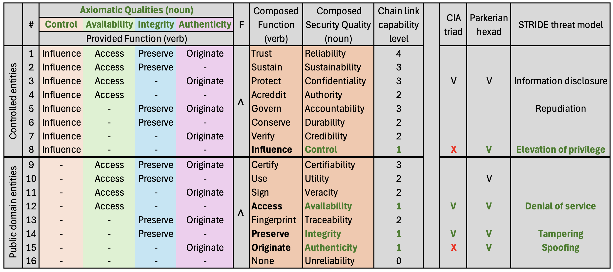

# A structured view on information security

## The CISQ-model hypothesis

### What is the CISQ-model?

The CISQ-model (Composing Information Security Qualities) builds on the hypothesis that there are exactly four basic security qualities. **Integrity, Authenticity, Availability and Control**. A total of 16 qualities can be composed from these four basic qualities, if we include the “none” quality and the four basic qualities them selves. The most useful subset of the model when dealing with a service is shown below.

### Why do we need more information security acronyms?

Although this model is much more complicated than the CIA-triad or even the STRIDE threat model, the CISQ-model presents an opportunity to approach information security in a way that can start at low complexity with only the four basic qualities, and then guides the user towards deeper understanding of their own system by introducing or eliminating security qualities. This is done by the composition. If a basic quality is important or seen as irrelevant for the system this insight can be used to guide attention to the higher order qualities composed form the basic qualities.
*"Rather than trying to change the world, change how people see the world. Because when they see the world differently, they behave differently and that will change the world" - Rory Sutherland*

The goal is to create a vocabulary for information security that covers the field of component security qualities as much as possible while minimizing overlap and ambiguity. Non-goals include legal, ethical and societal issues as well as describing system level properties such as defense in depth, resilience, anti-fragility and isolation. [A lengthy tale of system level properties may interest you](https://anderscj.substack.com/p/liberal-democracies-needs-a-new-compute)

### Foundations

For information objects the four basic qualities are as follows;

1. If the object is intact it is considered to have the **integrity** quality
2. If the object has a known origin it is considered to have the **authenticity** quality
3. If the object can be reached in a timely manner it is considered to have the **availability** quality
4. If the object is exclusively controlled by an enumerated set of entities it is considered to have the **control** quality

For behavior in an information system, such as a service, we have the same four qualities;

1. If the behavior is intact it is considered to have the **integrity** quality
2. If the behavior has a known origin it is considered to have the **authenticity** quality
3. If the behavior can be reached in a timely manner it is considered to have the **availability** quality
4. If the behavior is exclusively controlled by an enumerated set of entities it is considered to have the **control** quality

### Notable remarks

- Integrity and authenticity are both considered as discrete and absolute, whereas availability and control are continuous and open-ended. This has important consequences for how we can reason about information security. For instance the control quality will always be subject to “force majure” situations like an asteroid or government agency impacting your service, no mater how well the system is designed. The availability quality can span towards infinite time, hence making absolute guarantees difficult to define.
- The CISQ-model deliberately use the wording “basic” security quality, as opposed to “atomic” or “axiomatic” because these qualities may very well be broken down even further, just like the atom. This can be trivially shown for availability with the concepts of time, completeness and (network) partitioning in distributed systems all contributing their own aspects of availability. In other words the CISQ-model is more like the composed building blocks of the periodic table and less like the standard model of physics.

### The model in depth

The CISQ-model uses composition to expand the four basic security qualities (Integrity, Authenticity, Availability, Control) into a total of 16 qualities as shown in the table below.

Visualizing the composition of four aspects is not easy to get right. This view shows how we can simplify the model by splitting the model into two separate views. One model for systems that are controlled, typically by an organization and the other for public domain objects such as certificates.

### Vocabulary of the CISQ-Model

These definitions are a work in progress. two principles are important:

- Keep the definitions as short as possible, which is easier since the overloading of terms are much less than in the CIA-triad.
- Symmetry between information and behavior across all terms

**Reliability** – Trustworthy information and behavior

**Sustainability** - Ability to maintain information and behavior

**Confidentiality** - Access to information and behavior being exclusively limited to authorized entities

**Authority** - Power to grant access to information and behavior

**Accountability** - Assurance of the correctness, completeness and origin of information and behavior

**Durability** - Ability to withstand damage of integrity of information and behavior

**Credibility** - Verified information and behavior

**Control** - Power to physically or logically influence information and behavior

**Certifiability** - Ability to prove validity of information and behavior

**Utility** - Usefulness of information and behavior

**Veracity** - Accuracy of information and behavior

**Availability** - Timely access to information and behavior

**Traceability** - Ability to discover where and how information and behavior was made

**Integrity** - Preserving correctness and completeness of information and behavior

**Authenticity** - Origin of information and behavior is from its purported source

**Unreliability** - Not capable of providing security qualities for information and behavior

### Origin story

The CISQ-model comes with its own origin story. Se if you can spot the evolution from its first stage.
[A case against the CIA triad](https://anderscj.substack.com/p/a-case-against-the-cia-triad)
