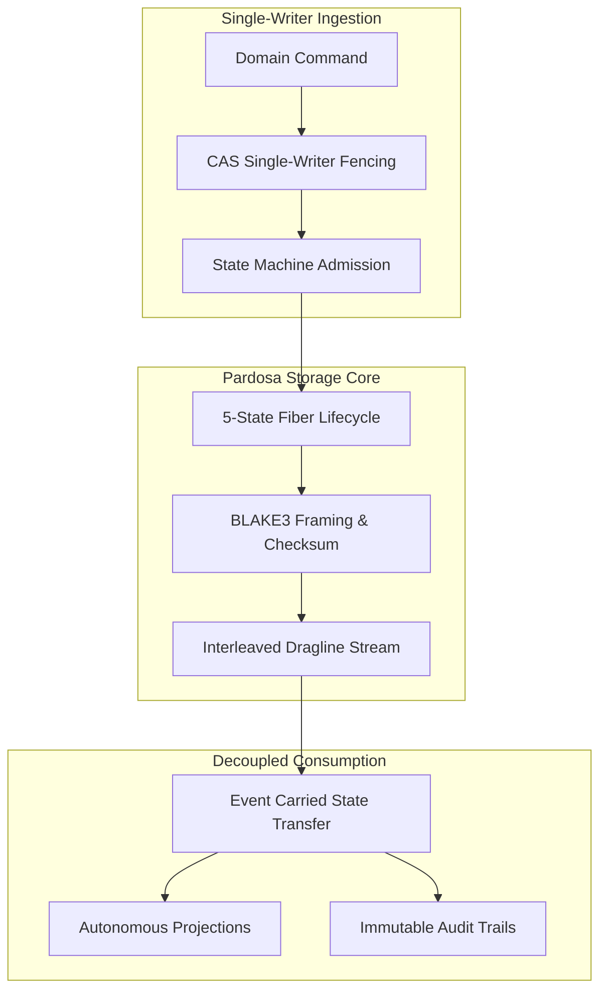
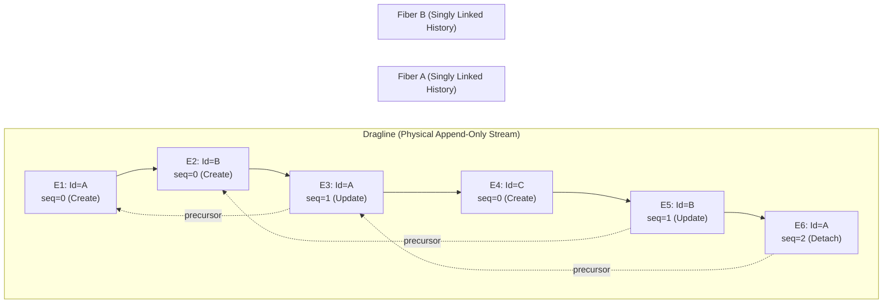
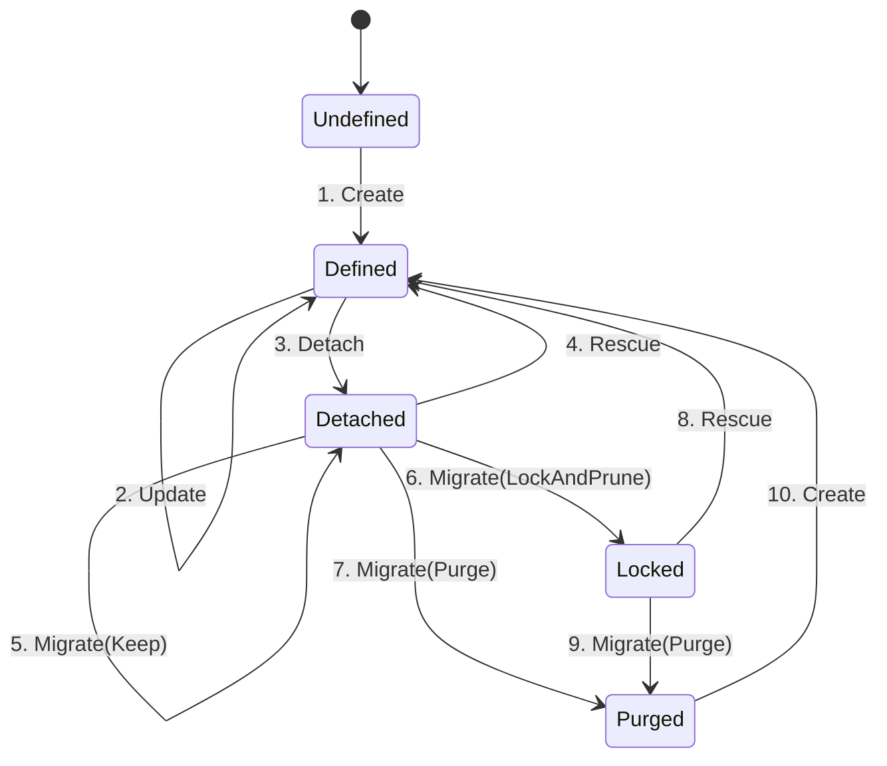
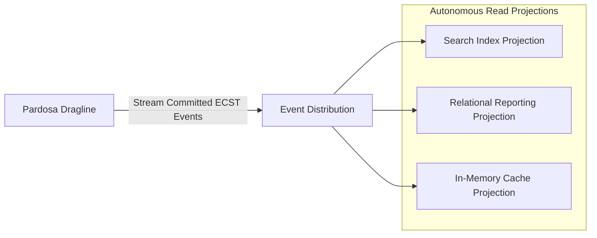

## Pardosa: Event-Driven Storage with Fiber Semantics

Modern distributed applications increasingly adopt Event-Driven Architecture (EDA) to decouple services and scale ingestion. However, when complex enterprise systems migrate to event sourcing, they frequently run into severe correctness hazards: split-brain concurrent mutations, silent aggregate state corruption, and the architectural inability to satisfy legal deletion mandates (such as GDPR "right to be forgotten") without corrupting immutable event histories.

`Pardosa` is an append-only event-driven storage engine implemented in Rust, built specifically upon the principles of **Fiber Semantics**. It is designed for enterprise domains where **correctness, strict auditability, and deterministic deletion policies matter far more than raw ingestion volume**. Pardosa guarantees per-aggregate linearizability and single-writer fencing, backed by a formal 5-state lifecycle state machine.

---

## The Strategic Problem: Enterprise State Corruption & Event-Driven Compliance

Traditional storage models fail in high-integrity enterprise environments along two major failure modes:

1. **Uncoordinated Distributed Mutation**: When multiple application nodes concurrently mutate shared entity state without aggregate-level fencing, race conditions inevitably overwrite updates. In relational databases, developers resort to brittle row locks or distributed transactions (2PC) that kill availability and latency. In generic distributed log systems (like raw Kafka or message queues), partitioning keys provide ordering across partitions, but provide no native validation that an incoming event represents a legal lifecycle transition for that specific entity.
2. **The Immutability vs. Deletion Paradox**: Event sourcing dogmatically insists that the log is forever immutable. However, enterprise systems operate under stringent regulatory and legal constraints (such as GDPR Article 17, healthcare data privacy, and legal retention limits) requiring verifiable, physical data deletion. Teams are left with unworkable workarounds: either breaking the audit log by performing out-of-band database mutations, or encrypting payloads and deleting encryption keys (crypto-shredding), which retains metadata and leaves storage reclamation unsolved.

Pardosa resolves this conflict by separating the physical append-only log (**dragline**) from aggregate lifecycle governance (**fibers**) and introducing auditable, verifiable **line migrations**.

---

## Fiber Semantics: Entities as Ordered Event Chains

In Fiber Semantics, the lifecycle history of each domain entity is called a **fiber**.

- **Definition**: A fiber is a singly linked list of immutable events belonging to a unique, domain-scoped identifier (`DomainId`).
- **Chain Topology**: Rather than storing events in a forward array that must be rewritten on mutation, each event in a fiber explicitly references its immediate predecessor through a `precursor` pointer (a cryptographic hash or logical sequence index).
- **Head-Anchored Traversal**: The active state of a fiber is always anchored at its newest event (the head). Reading an entity's current state requires inspecting only the head; traversing backward reconstructs historical state changes without requiring full-table scans.

Every event carries an immutable envelope header containing:
- `Timestamp`: Monotonic nanoseconds since epoch, set upon successful append.
- `DomainId`: Immutable identifier scoped to the domain namespace.
- `Precursor`: Cryptographic pointer linking to the prior event on the same fiber.
- `Detached`: Lifecycle marker indicating soft-deleted status.
- `DomainEvent`: Domain-specific schema payload.

---

## Draglines: Append-Only Interleaved Commit Streams

While domain entities exist logically as independent fibers, disk I/O and network replication perform best when streaming sequential data. Pardosa unifies these models through the **dragline**:

- **Interleaving**: Events from thousands of concurrent fibers are committed sequentially onto a shared dragline.
- **Per-Aggregate Linearizability**: Sequential consistency is enforced strictly per fiber. Single-writer fencing using Compare-And-Swap (CAS) ensures that an append succeeds if and only if the event's declared `precursor` matches the active head of that fiber. If a concurrent writer appends to the same fiber first, the CAS check fails immediately, preventing aggregate state corruption.
- **Physical Layout & Integrity**: Commits on the dragline are framed with BLAKE3 cryptographic hashes. Frames are appended with strict atomic durability (`write` $\rightarrow$ `fsync` $\rightarrow$ `atomic rename` $\rightarrow$ `parent dir fsync`), guaranteeing crash resilience against abrupt power loss or operating system faults.

---

## The 5-State Lifecycle State Machine

At the core of Pardosa is an explicit, formal state machine governing every fiber's lifecycle. An aggregate does not merely exist or get deleted; it transitions across five strictly defined states:

1. **`Undefined`**: The entity has never existed within the domain namespace.
2. **`Defined`**: The fiber is active, exists, and accepts updates.
3. **`Detached`**: The fiber is soft-deleted; it remains on the dragline for historical auditability and can be rescued or migrated.
4. **`Purged`**: The fiber has been permanently removed from the line following an auditable migration, satisfying regulatory deletion mandates while preserving optional audit records.
5. **`Locked`**: The fiber has been pruned and frozen; the identifier cannot be reused, preventing replay attacks or accidental recreation.

### The 10 Legal Transitions

Pardosa encodes exactly **10 legal state transitions**. Any action attempting an unlisted transition is rejected at compile time and runtime by the `IllegalStateTransition` error:

| # | Action | Source State | Target State | Operational Semantics |
|---|---|---|---|---|
| 1 | `Create` | `Undefined` | `Defined` | Initial creation of an entity from an empty state. |
| 2 | `Update` | `Defined` | `Defined` | Appending a new state-modifying event to an active fiber. |
| 3 | `Detach` | `Defined` | `Detached` | Soft-deleting an aggregate; marks head as detached. |
| 4 | `Rescue` | `Detached` | `Defined` | Reversing a soft delete; returns the fiber to active status. |
| 5 | `Migrate(Keep)` | `Detached` | `Detached` | Retains the soft-deleted fiber across a line migration. |
| 6 | `Migrate(LockAndPrune)` | `Detached` | `Locked` | Prunes fiber history, retaining only the tombstone; prevents reuse. |
| 7 | `Migrate(Purge)` | `Detached` | `Purged` | Verifiably scrubs all event payloads and keys from the active line. |
| 8 | `Rescue` | `Locked` | `Defined` | Administrative rescue of a locked fiber under an explicit audit policy. |
| 9 | `Migrate(Purge)` | `Locked` | `Purged` | Permanently purges a previously locked fiber during migration. |
| 10 | `Create` | `Purged` | `Defined` | Re-allocates the domain identifier cleanly following a complete purge. |

---

## Event Carried State Transfer (ECST) & Autonomous Projections

Traditional microservice architectures rely on distributed RPC or REST calls to fetch current state, creating cascading failure domains and tight operational coupling. 

Pardosa implements **Event Carried State Transfer (ECST)**:

- **Self-Contained Domain Facts**: Events emitted by Pardosa carry full state transition facts, not thin notifications ("Order #123 changed"). Downstream consumers receive all data necessary to update their local read projections without executing synchronous callback requests to the producer.
- **Autonomous Projections**: Read models (such as search indexes, reporting databases, or in-memory HTML render caches) consume the dragline independently at their own pace. If a projection service crashes or lags, write ingestion remains entirely unaffected.

---

## Regulatory Compliance & Verifiable Deletion

In enterprise architectures, compliance cannot be an afterthought. Pardosa satisfies privacy legislation (such as GDPR Article 17) through **auditable line migrations**:

1. **Separation of Line and Audit**: A line contains the active operational stream. An optional audit log captures raw events separately under strict access controls.
2. **Cryptographic Integrity**: Payloads and envelope headers are hashed using BLAKE3. Tampering with any historical event on a fiber breaks the precursor hash chain immediately.
3. **Physical Purging via Line Migration**: When an operator executes a line migration with `Migrate(Purge)` on detached fibers:
   - Pardosa constructs a new, compacted line version.
   - Events belonging to purged fibers are physically excluded from the new line.
   - Active fibers are reindexed, preserving their precursor relationships.
   - The old line version is scrubbed from disk, providing provable, physical data destruction while preserving cryptographic proof of the migration transaction itself.
