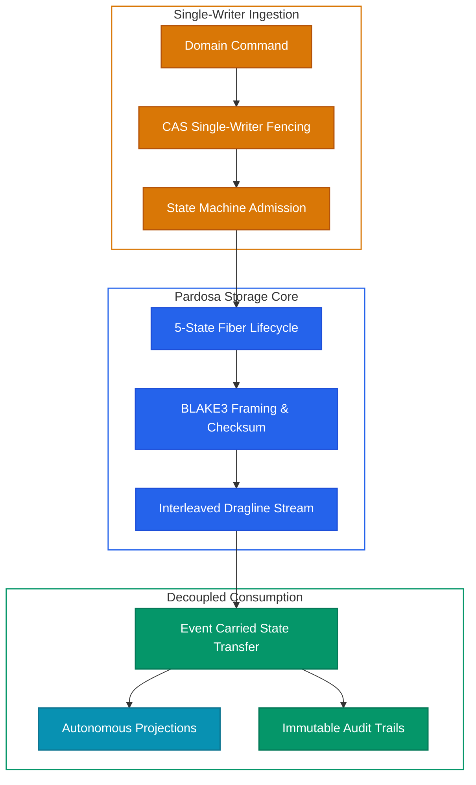
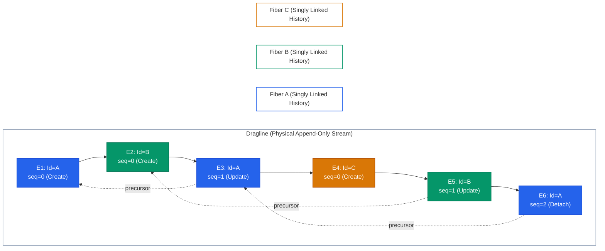

## Pardosa: Event-Driven Storage with Fiber Semantics

Modern distributed applications increasingly adopt Event-Driven Architecture (EDA) to decouple services and scale ingestion. However, when complex enterprise systems migrate to event sourcing, they frequently run into severe correctness hazards: split-brain concurrent mutations, silent aggregate state corruption, and the architectural inability to satisfy legal deletion mandates (such as GDPR "right to be forgotten") without corrupting immutable event histories.

`Pardosa` is an append-only event-driven storage engine implemented in Rust, built specifically upon the principles of **Fiber Semantics**. It is designed for enterprise domains where **correctness, strict auditability, and deterministic deletion policies matter far more than raw ingestion volume**. Pardosa guarantees per-aggregate linearizability and single-writer fencing, backed by a formal 5-state lifecycle state machine.

---

## Domain State Governance & Verifiable Deletion

High-integrity enterprise applications require event storage that enforces two foundational invariants:

1. **Domain State Governance**: In enterprise systems, business entities transition through structured lifecycles governed by formal domain rules. Without aggregate-level fencing and state-transition admission control, concurrent mutations risk overwriting entity state and committing illegal transitions. Pardosa enforces first-class aggregate fencing and deterministic lifecycle admission directly at the storage boundary, guaranteeing that every committed event represents a validated, sequential state transition for that specific entity.
2. **The Immutability vs. Deletion Paradox**: Event-sourced systems require immutable historical streams for auditability, replayability, and provenance. However, regulated enterprises operate under strict legal mandates (such as GDPR Article 17, healthcare data privacy standards, and statutory retention expirations) requiring verifiable, physical data deletion. Traditional workarounds—such as breaking audit trails via out-of-band record patching, or encrypting payloads and discarding keys (crypto-shredding)—leave metadata exposed, historical commitments unverifiable, and physical storage un-reclaimed.

Pardosa resolves this tension by separating physical append-only container files (**draglines**) from aggregate lifecycle governance (**fibers**) and introducing cryptographically auditable, verifiable **line migrations**.

---

## Fiber Semantics: Entities as Ordered Event Chains

In Fiber Semantics, the lifecycle history of each domain entity is modeled as an independent **fiber**:

- **Definition**: A fiber is a singly linked list of immutable events belonging to a unique, domain-scoped identifier (`fiber_id`).
- **Chain Topology**: Rather than storing events in a forward array that must be rewritten on mutation, each event in a fiber explicitly references its immediate predecessor through a `precursor` pointer (a 16-byte predecessor event ID and a 32-byte BLAKE3 precursor hash).
- **Head-Anchored Traversal**: The active state of a fiber is always anchored at its newest event (the head). Reading an entity's current state requires inspecting only the head; traversing backward reconstructs historical state transitions without requiring full-log scans.

---

## Draglines: Append-Only Interleaved Commit Streams

While domain entities exist logically as independent fibers, disk I/O and network replication achieve maximum efficiency through sequential streaming. Pardosa unifies these models through the **dragline**:

- **Interleaving**: Events from thousands of concurrent fibers are committed sequentially onto a shared dragline.
- **Per-Aggregate Linearizability**: Sequential consistency is enforced strictly per fiber. Single-writer fencing using Compare-And-Swap (CAS) ensures that an append succeeds if and only if the event's declared `precursor` matches the active head of that fiber. If a concurrent writer attempts to append to the same fiber simultaneously, the CAS check fails immediately, preventing aggregate state corruption.
- **Atomic Durability**: Frames are appended with strict atomic durability (`write` $\rightarrow$ `fsync` $\rightarrow$ `atomic rename` $\rightarrow$ `parent dir fsync`), guaranteeing crash resilience against power loss or operating system faults.

---

## Physical Data Structure: On-Disk Dragline Layout

Pardosa separates line state into an artefact pair on disk:

1. **`<stem>.meta` (Descriptor File)**: Stores line metadata, schema commitments, domain namespace scope, and partition ownership.
2. **`<stem>.pgno` (Dragline Container File)**: Append-only storage file containing the container header followed by framed event records.

  <!-- Container Header Block -->
  

    

      

        Offset 0x00..0x0B · 12 Bytes
        Container Header · Storage Format Identity
      

      Immutable Prefix
    

    

      

        
Magic Identifier (8B)

        
<code>PARDOSA\x01</code> [0x50, 0x41, 0x52, 0x44, 0x4F, 0x53, 0x41, 0x01]

        
Immutable engine signature identifying dragline container format

      

      

        
Format Version (4B)

        
<code>1 LE</code> [0x01, 0x00, 0x00, 0x00]

        
32-bit unsigned little-endian integer format version

      

    

  

  <!-- Flow Boundary: Container Header to Frame 0 -->
  

    

    
Initial Append Boundary: Offset 0x0C

    
▼

  

  <!-- FRAME 0 -->
  

    

      

        FRAME 0
        Offset 0x0C · Event 0 : Genesis on Fiber A
      

      Genesis Root
    

    
Physical Framing (8 Bytes Framing Overhead)

    

      

        
frame_length_0 (4B)

        
<code>u32 LE</code> 81 + N₀ Bytes

        
Byte length of enclosed Envelope 0 payload

      

      

        
CRC32C Checksum (4B)

        
<code>Castagnoli (SSE4.2)</code> IEEE 802.3

        
Hardware checksum detecting torn writes and disk bit-rot

      

    

    <!-- Inner Envelope 0 Card (Strictly Contained) -->
    

      

        

          Envelope 0
          Fiber A Genesis Aggregate · Invariant C4.19
        

        85 + payload_length_0 Bytes
      

      
EnvelopeHeader Fields (81 Bytes Fixed Layout)

      

        

          
event_id (16B)

          
<code>0x01.. [E0]</code>

          
UUID / ULID Identity

        

        

          
fiber_id (16B)

          
<code>0xAA.. [Fiber A]</code>

          
Aggregate Stream ID

        

        

          
detached (1B)

          
<code>0x00</code> (Active)

          
Lifecycle status flag

        

        

          
precursor (16B)

          
<code>[0u8; 16]</code>

          
Root Genesis (Null Pointer)

        

        

          
precursor_hash (32B)

          
<code>[0u8; 32]</code>

          
Root Genesis (Zero Hash)

        

      

      
Domain Event Payload (N₀ Bytes)

      

        

          
payload_length_0 (4B)

          
<code>u32 LE</code> N₀

          
32-bit integer length of Genesis payload

        

        

          
payload_bytes (N₀ B)

          
<code>GenesisState</code>

          
Initial state machine admission payload

        

      

    

    <!-- Bottom Badge: Physical Rolling Digest H0 -->
    

      

        H₀
        <strong>Physical Rolling Digest H₀ (32B):</strong>
        <code>BLAKE3(Frame 0)</code>
      

      
Base container commitment for sequential tamper-evidence

    

  

  <!-- Inter-Frame Connector Block -->
  

    

      Inter-Frame Linkages &amp; Transitions
      Append progression, causal binding &amp; tamper verification
    

    

      

        
1

        

          
Physical Sequential Append

          
Offset: <code>0x0C + L₀ + 8</code>

          
Advances past Frame 0 framing (8B) and envelope payload (L₀ bytes)

        

      

      

        
2

        

          
Logical Precursor Link

          
Points to <code>E0 [0x01..]</code>

          
Enforces single-writer linearizability on Fiber A via CAS head check

        

      

      

        
3

        

          
Causal Commitment (Invariant C5.40)

          
<code>BLAKE3(Envelope 0)</code>

          
Cryptographic parent commitment prevents silent aggregate history rewrite

        

      

      

        
4

        

          
Physical Rolling Fold (Invariant C5.26)

          
<code>BLAKE3(H₀ ∥ Frame 1)</code>

          
Sequential tamper-evidence accumulated across all physical frames

        

      

    

    

      

      
▼

    

  

  <!-- FRAME 1 -->
  

    

      

        FRAME 1
        Offset 0x0C + L₀ + 8 · Event 1 : State Mutation on Fiber A
      

      Fiber A Mutation
    

    
Physical Framing (8 Bytes Framing Overhead)

    

      

        
frame_length_1 (4B)

        
<code>u32 LE</code> 81 + N₁ Bytes

        
Byte length of enclosed Envelope 1 payload

      

      

        
CRC32C Checksum (4B)

        
<code>Castagnoli (SSE4.2)</code> IEEE 802.3

        
Hardware checksum detecting torn writes and disk bit-rot

      

    

    <!-- Inner Envelope 1 Card (Strictly Contained) -->
    

      

        

          Envelope 1
          Fiber A State Mutation · Invariant C4.19
        

        85 + payload_length_1 Bytes
      

      
EnvelopeHeader Fields (81 Bytes Fixed Layout)

      

        

          
event_id (16B)

          
<code>0x02.. [E1]</code>

          
UUID / ULID Identity

        

        

          
fiber_id (16B)

          
<code>0xAA.. [Fiber A]</code>

          
Aggregate Stream ID

        

        

          
detached (1B)

          
<code>0x00</code> (Active)

          
Lifecycle status flag

        

        

          
precursor (16B) · Link

          
<code>0x01.. [E0]</code>

          
Points to E0 (Linear predecessor)

        

        

          
precursor_hash (32B) · Causal

          
<code>BLAKE3(Envelope 0)</code>

          
Cryptographic parent commitment

        

      

      
Domain Event Payload (N₁ Bytes)

      

        

          
payload_length_1 (4B)

          
<code>u32 LE</code> N₁

          
32-bit integer length of Mutation payload

        

        

          
payload_bytes (N₁ B)

          
<code>AccountUpdated</code>

          
Committed state transition payload

        

      

    

    <!-- Bottom Badge: Physical Rolling Digest H1 (Emerald Highlighted) -->
    

      

        H₁
        <strong>Physical Rolling Digest H₁ (32B):</strong>
        <code>BLAKE3(H₀ ∥ Frame 1)</code>
      

      
Sequential Tamper-Evidence (Invariant C5.26) · Folded sequentially across frames

    

  

### 1. Container Header (12 Bytes)
At file offset `0x00000000` of `<stem>.pgno`, the container header establishes format identity:
- **Magic Bytes (`0x00..0x07`, 8 bytes)**: Fixed byte sequence `PARDOSA\x01` (`[0x50, 0x41, 0x52, 0x44, 0x4F, 0x53, 0x41, 0x01]`).
- **Format Version (`0x08..0x0B`, 4 bytes)**: 32-bit little-endian integer (`1` = `0x01, 0x00, 0x00, 0x00`).

Any file lacking this 12-byte signature is rejected during container initialization.

### 2. Frame Framing (Invariant C3.4)
Every commit to the dragline is framed with length demarcations and hardware-accelerated checksums:
- **Length Prefix (4 bytes)**: 32-bit little-endian unsigned integer declaring the byte length of the enclosed frame payload.
- **Frame Payload (`frame_length` bytes)**: The unpadded event envelope.
- **CRC32C Checksum (4 bytes)**: Castagnoli polynomial checksum (IEEE 802.3 / SSE4.2 CRC32C) computed over the frame payload bytes. Torn writes, truncated disk blocks, or silent disk bit-rot are detected prior to envelope parsing.

### 3. Event Envelope Header (Invariant C4.19)
The frame payload contains an unpadded, fixed 81-byte `EnvelopeHeader` followed by the domain event payload:

| Field | Offset | Width | Type | Description |
|---|---|---|---|---|
| `event_id` | `0x00` | 16 bytes | `[u8; 16]` | Globally unique event identifier (UUID/ULID). |
| `fiber_id` | `0x10` | 16 bytes | `[u8; 16]` | Scoped domain entity / aggregate identifier. |
| `detached` | `0x20` | 1 byte | `bool` (`u8`) | Lifecycle flag: `0x00` = active, `0x01` = soft-deleted. |
| `precursor` | `0x21` | 16 bytes | `[u8; 16]` | Predecessor `event_id` on this fiber (`[0u8; 16]` for root). |
| `precursor_hash` | `0x31` | 32 bytes | `[u8; 32]` | 256-bit BLAKE3 cryptographic hash of precursor event. |
| `payload_length` | `0x51` | 4 bytes | `u32` LE | Byte length $N$ of domain event payload. |
| `payload_bytes` | `0x55` | $N$ bytes | `[u8; N]` | Serialized domain-specific event payload. |

Total unpadded envelope length is exactly $81 + 4 + N = 85 + \text{payload\_length}$ bytes.

### 4. Physical vs. Logical Cryptographic Commitments

Pardosa maintains two complementary, orthogonal cryptographic chains:

```mermaid
flowchart TD
    subgraph PhysicalChain ["Physical Integrity Chain (Invariant C5.26)"]
        direction LR
        P0["Frame 0"] -->|BLAKE3 Fold| P1["Frame 1"]
        P1 -->|BLAKE3 Fold| P2["Frame 2"]
        P2 -->|BLAKE3 Fold| P3["Frame 3"]
        P3 -->|Rolling Digest H_k| PROOF["Physical Log Commitment"]
    end

    subgraph LogicalChains ["Logical Precursor Chains (Invariant C5.40)"]
        direction TB
        subgraph FiberAlpha ["Fiber Alpha"]
            A0["E0 (Root)"]
            A1["E2 (Update)"]
            A1 -. precursor_hash .-> A0
        end
        subgraph FiberBeta ["Fiber Beta"]
            B0["E1 (Root)"]
            B1["E3 (Update)"]
            B1 -. precursor_hash .-> B0
        end
    end

    classDef slate fill:#475569,stroke:#334155,stroke-width:1.5px,color:#ffffff
    classDef blue fill:#2563eb,stroke:#1d4ed8,stroke-width:1.5px,color:#ffffff
    classDef green fill:#059669,stroke:#047857,stroke-width:1.5px,color:#ffffff

    class P0,P1,P2,P3 slate
    class PROOF green
    class A0,A1 blue
    class B0,B1 green

    style PhysicalChain fill:transparent,stroke:#475569,stroke-width:1.5px
    style LogicalChains fill:transparent,stroke:#94a3b8,stroke-width:1.5px
    style FiberAlpha fill:transparent,stroke:#2563eb,stroke-width:1.5px
    style FiberBeta fill:transparent,stroke:#059669,stroke-width:1.5px
```

- **Physical Rolling Commitment (Invariant C5.26)**: A running 256-bit BLAKE3 hash digest computed sequentially across all container frames in `<stem>.pgno`. Each frame $k$ is folded into the rolling commitment:
  $$\mathcal{H}_k = \text{BLAKE3}(\mathcal{H}_{k-1} \parallel \text{Frame}_k)$$
  This guarantees immediate tamper-evidence for the physical stream: missing frames, reordered writes, or bit flips corrupt the rolling digest.
- **Logical Precursor Chain (Invariant C5.40)**: Independent, fiber-scoped hash linkage. Each event's `precursor_hash` contains the BLAKE3 digest of the preceding event on the same `fiber_id`.
- **Orthogonality**: Because physical commitments track file framing and logical commitments track aggregate state transitions, events from distinct fibers interleave freely without invalidating entity provenance. During line migrations, purged fibers can be pruned from `<stem>.pgno` without breaking the precursor chains of surviving fibers.

---

## The 5-State Lifecycle State Machine

At the core of Pardosa is an explicit, formal state machine governing every fiber's lifecycle. An aggregate does not merely exist or get deleted; it transitions across five strictly defined states:

1. **`Undefined`**: The entity has never existed within the domain namespace.
2. **`Defined`**: The fiber is active, exists, and accepts updates.
3. **`Detached`**: The fiber is soft-deleted; it remains on the dragline for historical auditability and can be rescued or migrated.
4. **`Purged`**: The fiber has been permanently removed from the line following an auditable migration, satisfying regulatory deletion mandates while preserving optional audit records.
5. **`Locked`**: The fiber has been pruned and frozen; the identifier cannot be reused, preventing replay attacks or accidental recreation.

### The 10 Legal Transitions

Pardosa encodes exactly **10 legal state transitions**. Any action attempting an unlisted transition is rejected at compile time and runtime by the `IllegalStateTransition` error:

<svg id="state-diagram" viewBox="0 0 1060 510" width="100%" height="auto" style="display: block; min-width: 780px; max-width: 1060px; margin: 0 auto; overflow: visible;">
<defs>
<marker id="arrow-slate" viewBox="0 0 10 10" refX="7" refY="5" markerWidth="6" markerHeight="6" orient="auto-start-reverse">
<path d="M 0 1.5 L 8 5 L 0 8.5 z" class="arrow-slate-fill" />
</marker>
<marker id="arrow-blue" viewBox="0 0 10 10" refX="7" refY="5" markerWidth="6" markerHeight="6" orient="auto-start-reverse">
<path d="M 0 1.5 L 8 5 L 0 8.5 z" class="arrow-blue-fill" />
</marker>
<marker id="arrow-amber" viewBox="0 0 10 10" refX="7" refY="5" markerWidth="6" markerHeight="6" orient="auto-start-reverse">
<path d="M 0 1.5 L 8 5 L 0 8.5 z" class="arrow-amber-fill" />
</marker>
<marker id="arrow-purple" viewBox="0 0 10 10" refX="7" refY="5" markerWidth="6" markerHeight="6" orient="auto-start-reverse">
<path d="M 0 1.5 L 8 5 L 0 8.5 z" class="arrow-purple-fill" />
</marker>
<marker id="arrow-rose" viewBox="0 0 10 10" refX="7" refY="5" markerWidth="6" markerHeight="6" orient="auto-start-reverse">
<path d="M 0 1.5 L 8 5 L 0 8.5 z" class="arrow-rose-fill" />
</marker>
<filter id="shadow" x="-5%" y="-5%" width="110%" height="115%" filterUnits="userSpaceOnUse">
<feDropShadow dx="0" dy="2" stdDeviation="3" flood-color="#000000" flood-opacity="0.08"/>
</filter>
</defs>

<circle cx="210" cy="60" r="8" fill="var(--sm-slate-stroke)"/>
<path d="M 218,60 L 277,60" class="edge-path" stroke="var(--sm-slate-stroke)" marker-end="url(#arrow-slate)"/>
<path d="M 360,85 L 360,157" class="edge-path" stroke="var(--sm-blue-stroke)" marker-end="url(#arrow-blue)"/>
<path d="M 280,172 C 190,130 90,130 90,187 C 90,244 190,244 280,202" class="edge-path" stroke="var(--sm-blue-stroke)" marker-end="url(#arrow-blue)"/>
<path d="M 440,173 C 485,153 555,153 597,173" class="edge-path" stroke="var(--sm-amber-stroke)" marker-end="url(#arrow-amber)"/>
<path d="M 600,201 C 555,221 485,221 443,201" class="edge-path" stroke="var(--sm-blue-stroke)" marker-end="url(#arrow-blue)"/>
<path d="M 760,172 C 850,130 970,130 970,187 C 970,244 850,244 760,202" class="edge-path" stroke="var(--sm-amber-stroke)" marker-end="url(#arrow-amber)"/>
<path d="M 705,214 L 705,397" class="edge-path" stroke="var(--sm-purple-stroke)" marker-end="url(#arrow-purple)"/>
<path d="M 620,214 C 595,270 455,340 423,397" class="edge-path" stroke="var(--sm-rose-stroke)" marker-end="url(#arrow-rose)"/>
<path d="M 620,400 C 595,344 455,274 423,217" class="edge-halo"/>
<path d="M 620,400 C 595,344 455,274 423,217" class="edge-path" stroke="var(--sm-blue-stroke)" marker-end="url(#arrow-blue)"/>
<path d="M 600,427 L 443,427" class="edge-path" stroke="var(--sm-rose-stroke)" marker-end="url(#arrow-rose)"/>
<path d="M 335,400 L 335,217" class="edge-path" stroke="var(--sm-blue-stroke)" marker-end="url(#arrow-blue)"/>
<g id="edge-1">
<rect class="badge-bg" x="317" y="109" width="86" height="24" rx="12"/>
<text class="edge-label badge-txt" x="360" y="121" dominant-baseline="central" text-anchor="middle">1. Create</text>
</g>
<g id="label-update">
<rect id="rect-update" class="badge-bg" x="46" y="175" width="88" height="24" rx="12"/>
<text id="text-update" class="edge-label badge-txt" x="90" y="187" dominant-baseline="central" text-anchor="middle">2. Update</text>
</g>
<g id="edge-3">
<rect class="badge-bg" x="477" y="137" width="86" height="24" rx="12"/>
<text class="edge-label badge-txt" x="520" y="149" dominant-baseline="central" text-anchor="middle">3. Detach</text>
</g>
<g id="edge-4">
<rect class="badge-bg" x="477" y="213" width="86" height="24" rx="12"/>
<text class="edge-label badge-txt" x="520" y="225" dominant-baseline="central" text-anchor="middle">4. Rescue</text>
</g>
<g id="label-migrate-keep">
<rect id="rect-migrate-keep" class="badge-bg" x="897" y="175" width="146" height="24" rx="12"/>
<text id="text-migrate-keep" class="edge-label badge-txt" x="970" y="187" dominant-baseline="central" text-anchor="middle">5. Migrate(Keep)</text>
</g>
<g id="edge-6">
<rect class="badge-bg" x="612" y="294" width="186" height="24" rx="12"/>
<text class="edge-label badge-txt" x="705" y="306" dominant-baseline="central" text-anchor="middle">6. Migrate(LockAndPrune)</text>
</g>
<g id="edge-7">
<rect class="badge-bg" x="506" y="243" width="138" height="24" rx="12"/>
<text class="edge-label badge-txt" x="575" y="255" dominant-baseline="central" text-anchor="middle">7. Migrate(Purge)</text>
</g>
<g id="edge-8">
<rect class="badge-bg" x="532" y="343" width="86" height="24" rx="12"/>
<text class="edge-label badge-txt" x="575" y="355" dominant-baseline="central" text-anchor="middle">8. Rescue</text>
</g>
<g id="edge-9">
<rect class="badge-bg" x="451" y="415" width="138" height="24" rx="12"/>
<text class="edge-label badge-txt" x="520" y="427" dominant-baseline="central" text-anchor="middle">9. Migrate(Purge)</text>
</g>
<g id="edge-10">
<rect class="badge-bg" x="292" y="294" width="86" height="24" rx="12"/>
<text class="edge-label badge-txt" x="335" y="306" dominant-baseline="central" text-anchor="middle">10. Create</text>
</g>
<g id="state-undefined" transform="translate(280, 35)">
<rect id="rect-undefined" width="160" height="50" rx="8" fill="var(--sm-slate-bg)" stroke="var(--sm-slate-stroke)" stroke-width="2" filter="url(#shadow)"/>
<rect width="6" height="50" rx="3" fill="var(--sm-slate-stroke)"/>
<text id="text-undefined" class="state-title" x="20" y="25" fill="var(--sm-slate-text)" dominant-baseline="central">Undefined</text>
<text class="state-sub" x="20" y="40" fill="var(--sm-slate-sub)">Initial State</text>
</g>
<g id="state-defined" transform="translate(280, 160)">
<rect id="rect-defined" width="160" height="54" rx="8" fill="var(--sm-blue-bg)" stroke="var(--sm-blue-stroke)" stroke-width="2.5" filter="url(#shadow)"/>
<rect width="6" height="54" rx="3" fill="var(--sm-blue-stroke)"/>
<text id="text-defined" class="state-title" x="20" y="27" fill="var(--sm-blue-text)" dominant-baseline="central">Defined</text>
<text class="state-sub" x="20" y="43" fill="var(--sm-blue-sub)">Active &amp; Linearized</text>
</g>
<g id="state-detached" transform="translate(600, 160)">
<rect id="rect-detached" width="160" height="54" rx="8" fill="var(--sm-amber-bg)" stroke="var(--sm-amber-stroke)" stroke-width="2.5" filter="url(#shadow)"/>
<rect width="6" height="54" rx="3" fill="var(--sm-amber-stroke)"/>
<text id="text-detached" class="state-title" x="20" y="27" fill="var(--sm-amber-text)" dominant-baseline="central">Detached</text>
<text class="state-sub" x="20" y="43" fill="var(--sm-amber-sub)">Soft-Deleted</text>
</g>
<g id="state-locked" transform="translate(600, 400)">
<rect id="rect-locked" width="160" height="54" rx="8" fill="var(--sm-purple-bg)" stroke="var(--sm-purple-stroke)" stroke-width="2.5" filter="url(#shadow)"/>
<rect width="6" height="54" rx="3" fill="var(--sm-purple-stroke)"/>
<text id="text-locked" class="state-title" x="20" y="27" fill="var(--sm-purple-text)" dominant-baseline="central">Locked</text>
<text class="state-sub" x="20" y="43" fill="var(--sm-purple-sub)">Frozen Tombstone</text>
</g>
<g id="state-purged" transform="translate(280, 400)">
<rect id="rect-purged" width="160" height="54" rx="8" fill="var(--sm-rose-bg)" stroke="var(--sm-rose-stroke)" stroke-width="2.5" filter="url(#shadow)"/>
<rect width="6" height="54" rx="3" fill="var(--sm-rose-stroke)"/>
<text id="text-purged" class="state-title" x="20" y="27" fill="var(--sm-rose-text)" dominant-baseline="central">Purged</text>
<text class="state-sub" x="20" y="43" fill="var(--sm-rose-sub)">Permanently Scrubbed</text>
</g>
</svg>

| # | Action | Source State | Target State | Operational Semantics |
|---|---|---|---|---|
| 1 | `Create` | `Undefined` | `Defined` | Initial creation of an entity from an empty state. |
| 2 | `Update` | `Defined` | `Defined` | Appending a new state-modifying event to an active fiber. |
| 3 | `Detach` | `Defined` | `Detached` | Soft-deleting an aggregate; marks head as detached. |
| 4 | `Rescue` | `Detached` | `Defined` | Reversing a soft delete; returns the fiber to active status. |
| 5 | `Migrate(Keep)` | `Detached` | `Detached` | Retains the soft-deleted fiber across a line migration. |
| 6 | `Migrate(LockAndPrune)` | `Detached` | `Locked` | Prunes fiber history, retaining only the tombstone; prevents reuse. |
| 7 | `Migrate(Purge)` | `Detached` | `Purged` | Verifiably scrubs all event payloads and keys from the active line. |
| 8 | `Rescue` | `Locked` | `Defined` | Administrative rescue of a locked fiber under an explicit audit policy. |
| 9 | `Migrate(Purge)` | `Locked` | `Purged` | Permanently purges a previously locked fiber during migration. |
| 10 | `Create` | `Purged` | `Defined` | Re-allocates the domain identifier cleanly following a complete purge. |

---

## Consumer Idempotency & Deterministic Projections

In event-driven architectures, downstream systems build read models, search indexes, in-memory view models, and pre-rendered caches by projecting the event stream. Pardosa guarantees deterministic consumption and effectively exactly-once processing through authoritative core engine invariants and architectural demarcation rather than relying on external database transactions:

  

    

      

        Pipeline Architecture
        Pardosa Dragline ➔ Monotonic Cursor ➔ Consumer Adapter Fold
      

      Demarcated Pipeline
    

    

      Architectural demarcation separating engine-level append guarantees from downstream read-model projections. Downstream adapters fold immutable event facts autonomously with zero RPC callbacks and zero relational multi-row transaction coupling.
    

  

  

    <!-- Stage 1: Pardosa Core Engine -->
    

      

        

          Stage 1
          Pardosa Dragline
        

        Core Engine
      

      
Log Guarantees (C3.8 · C4.19)

      

        

          
Total Replay Order (C3.8)

          
<code>&lt;stem&gt;.pgno Append Log</code>

          
Immutable physical total order over all events [E₁, E₂, ..., E_N] within the container.

        

        

          
Cryptographic Identity (C4.19)

          
<code>81B Header · BLAKE3</code>

          
16B event_id and 32B BLAKE3 precursor commitment hash per event envelope.

        

        

          
Sequential Streaming API

          
<code>stream_from(cursor)</code>

          
Linear non-blocking frame dispatch to registered consumer adapters.

        

      

    

    <!-- Stage 2: Monotonic Resume Cursor -->
    

      

        

          Stage 2
          Monotonic Cursor
        

        Invariant C5.22
      

      
Cursor Guarantees (C5.22)

      

        

          
Physical Frame Boundary

          
<code>u64 Byte Offset</code>

          
Monotonic 64-bit physical byte offset pointing strictly to verified frame boundaries.

        

        

          
Valid by Construction

          
<code>Zero-Scan Resumption</code>

          
Unaligned offsets are unrepresentable; resumes immediately without log parsing.

        

        

          
Lifecycle Scope

          
<code>Dragline-Local Scope</code>

          
Bound to container lifetime; regenerated during migrations with no cross-line leakage.

        

      

    

    <!-- Stage 3: Consumer Adapter Fold -->
    

      

        

          Stage 3
          Consumer Adapter
        

        Projection Fold
      

      
Adapter Ownership (Demarcation)

      

        

          
Pure Deterministic Fold

          
<code>State_N = fold(State₀, [E₁..E_N])</code>

          
Pure reduction function transforms immutable event stream into typed view models.

        

        

          
ECST Autonomy

          
<code>Self-Contained Facts</code>

          
Events carry complete domain transition facts; zero synchronous RPC callback queries.

        

        

          
Idempotency &amp; Dedup

          
<code>16B event_id / Upsert Keys</code>

          
Deduplication windows and natural upsert keys eliminate side effects across retries.

        

      

    

  

  <!-- Connector / Progression Bar -->
  

    

      
End-to-End Projection Lifecycle

      
Sequential Fact Propagation Across Demarcation Boundary

    

    

      

        
1

        

          
Frame Append &amp; Commit

          
<code>Single-Writer CAS</code> ➔ <code>.pgno</code>

          
Linearizable append logs frame with CRC32C framing and rolling BLAKE3 commitment.

        

      

      

        
2

        

          
Cursor Query &amp; Dispatch

          
<code>stream_from(cursor)</code> ➔ <code>Events [E_k]</code>

          
Consumer adapter queries stream from its persisted monotonic byte offset (C5.22).

        

      

      

        
3

        

          
Deterministic State Fold

          
<code>State_N = fold(State_{N-1}, E_N)</code>

          
Adapter folds self-contained facts (ECST) into view models without RPC callbacks.

        

      

      

        
4

        

          
Autonomous Read Serving

          
<code>Read Models</code> ➔ <code>O(1) Queries</code>

          
Downstream consumers (e.g. Spandrel static cache) serve reads with zero write contention.

        

      

    

  

### Core Engine Invariants

1. **Deterministic Event Folds (Invariant C3.8)**: An artefact holds exactly one total order over all events it carries on `<stem>.pgno`, and replaying it yields that identical order every time. Replaying the identical sequence of dragline frames produces identical projection state bit-for-bit:
   $$\text{State}_N = \text{fold}(\text{State}_0, [E_1, E_2, \dots, E_N])$$
   Projections rely strictly on immutable event facts—timestamps, precursors, and state payloads—eliminating dependencies on consumer arrival time, wall-clock skew, network transit delays, or execution environment non-determinism. Downstream read models can rebuild their entire state deterministically from genesis ($\text{State}_0$) or incrementally from any verified checkpoint frame.
2. **Dragline-Local Resume Cursors (Invariant C5.22)**: Pardosa exposes a resume cursor that is dragline-local and valid by construction. Monotonic 64-bit physical byte offsets point directly to verified frame boundaries within `<stem>.pgno`. Cursors are valid by construction: a consumer cannot construct or advance to an unaligned offset or an uncommitted frame. When resuming after restarts or failovers, consumers invoke `stream_from(cursor)` to resume streaming directly from that byte boundary without scanning logs, indexing tables, or re-processing previously committed frames. Cursors are regenerated during migrations and have no meaning across migrations.
3. **Cryptographic Event Identity & Commitments (Invariant C4.19)**: Every event envelope carries a fixed 81-byte wire header containing a globally unique 16-byte `event_id` (128-bit UUID), a 16-byte `fiber_id`, a 1-byte detachment flag, a 16-byte `precursor` UUID, and a 32-byte BLAKE3 `precursor_hash` commitment (both frame-level digest and fiber precursor hash). Combined with hardware-accelerated CRC32C framing, this cryptographic commitment enables unconditional deduplication: downstream consumer adapters can detect re-delivered frames and eliminate duplicate side-effects unconditionally.

### Event Carried State Transfer (ECST)

- **Self-Contained Domain Facts**: Events emitted by Pardosa carry full state transition facts rather than thin notifications (e.g., entity IDs requiring subsequent queries). Downstream consumers receive all data necessary to project their read models without executing synchronous callback queries or RPC round-trips to the producer or source datastore.
- **Autonomous Projections**: Read models (in-memory view models, search indexes, analytical column stores, Spandrel static cache stores) consume the dragline independently at their own pace. If a consumer crashes, restarts, or lags during bulk backpressure, write ingestion into the Pardosa dragline remains completely unaffected.

### Adapter Demarcation & Side-Effect Elimination

To maintain clean architectural boundaries and prevent coupling engine storage to external sinks, Pardosa enforces strict demarcation between core engine responsibilities and consumer-side adapter responsibilities:

| Responsibility | Pardosa Core Engine | Consumer-Side Adapter (e.g., Spandrel) |
|---|---|---|
| **Log Storage & Framing** | Physical append log (`.pgno`), frame CRC32C, BLAKE3 rolling commitments | Downstream read models (SQLite, memory maps, search indexes, static HTML caches) |
| **Ordering & Cursors** | Total log order (C3.8), dragline-local cursor offsets (C5.22) | Cursor offset persistence, checkpoint retention, replay coordination |
| **Identity & Mapping** | 16-byte `event_id`, 16-byte `fiber_id`, precursor causal chains | Domain aggregate IDs (`IssueId`, `AccountId`), in-memory `FiberIndex` mapping |
| **State Transformation** | Raw frame envelope serialization, byte-level framing validation | Pure projection fold functions (`State_N = fold(State_{N-1}, E_N)`), view models |
| **Side-Effect Elimination** | Unconditional deduplication metadata (C4.19 BLAKE3 commitments) | Idempotent upserts, bounded dedup filters, zero RPC callbacks |

Downstream consumer adapters achieve side-effect elimination and effectively exactly-once processing through:
- **Pure Mathematical Folds**: Downstream projections model state accumulation as pure, deterministic functions over immutable events: $\text{State}_N = \text{fold}(\text{State}_{N-1}, E_N)$. Reprocessing the log from genesis or from a verified checkpoint cursor yields identical bit-level state.
- **Cryptographic Deduplication (C4.19)**: For sinks with external side effects (e.g., message queues, webhook dispatchers, search indexes), adapters use the 16-byte `event_id` or 32-byte BLAKE3 precursor hash as natural idempotency tokens. Duplicate deliveries within a replay window are identified and dropped as no-ops prior to external invocation.
- **Adapter-Owned Cursor Persistence**: Adapters record their dragline-local cursor alongside their projected view model. On crash recovery, the adapter reads its persisted cursor and calls `stream_from(cursor)` to resume exactly where processing halted without requiring engine-level multi-row database transactions.

---

## Regulatory Compliance & Verifiable Deletion

In enterprise architectures, compliance cannot be an afterthought. Pardosa satisfies privacy legislation (such as GDPR Article 17) through **auditable line migrations**:

1. **Separation of Line and Audit**: A line contains the active operational stream. An optional audit log captures raw events separately under strict access controls.
2. **Cryptographic Integrity**: Payloads and envelope headers are hashed using BLAKE3. Tampering with any historical event on a fiber breaks the precursor hash chain immediately.
3. **Physical Purging via Line Migration**: When an operator executes a line migration with `Migrate(Purge)` on detached fibers:
   - Pardosa constructs a new, compacted line version (`<new_stem>.pgno` and `<new_stem>.meta`).
   - Events belonging to purged fibers are physically excluded from the new container file.
   - Active fibers are preserved, retaining their exact logical precursor hash relationships.
   - A fresh physical rolling BLAKE3 commitment is computed sequentially over the new container.
   - The old line version is verifiably scrubbed from disk, providing provable physical data destruction while preserving cryptographic proof of the migration transaction itself.

