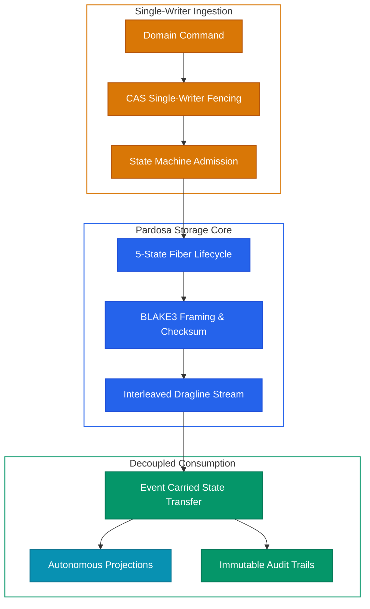
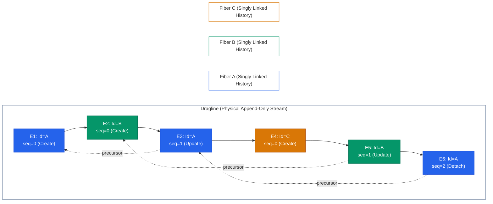
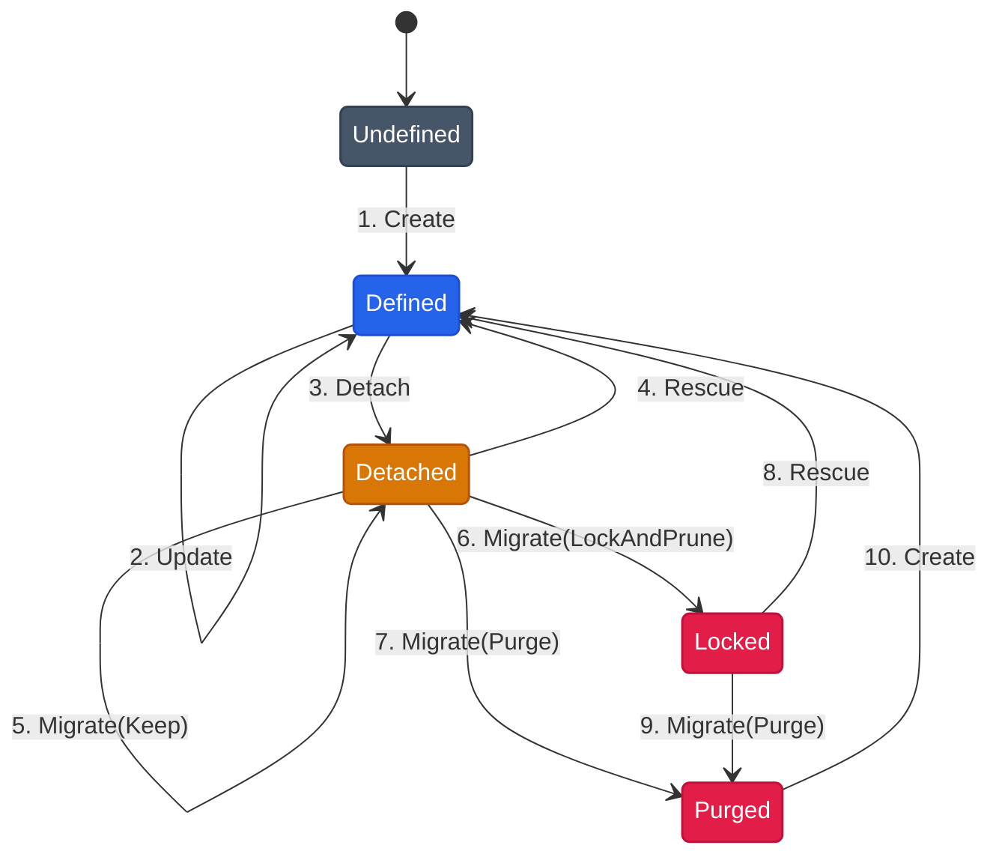
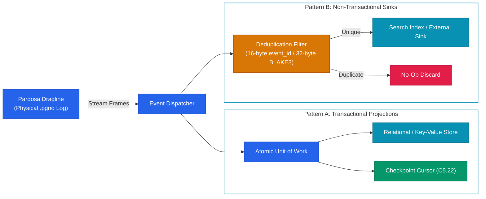

## Pardosa: Event-Driven Storage with Fiber Semantics

Modern distributed applications increasingly adopt Event-Driven Architecture (EDA) to decouple services and scale ingestion. However, when complex enterprise systems migrate to event sourcing, they frequently run into severe correctness hazards: split-brain concurrent mutations, silent aggregate state corruption, and the architectural inability to satisfy legal deletion mandates (such as GDPR "right to be forgotten") without corrupting immutable event histories.

`Pardosa` is an append-only event-driven storage engine implemented in Rust, built specifically upon the principles of **Fiber Semantics**. It is designed for enterprise domains where **correctness, strict auditability, and deterministic deletion policies matter far more than raw ingestion volume**. Pardosa guarantees per-aggregate linearizability and single-writer fencing, backed by a formal 5-state lifecycle state machine.



---

## Domain State Governance & Verifiable Deletion

High-integrity enterprise applications require event storage that enforces two foundational invariants:

1. **Domain State Governance**: In enterprise systems, business entities transition through structured lifecycles governed by formal domain rules. Without aggregate-level fencing and state-transition admission control, concurrent mutations risk overwriting entity state and committing illegal transitions. Pardosa enforces first-class aggregate fencing and deterministic lifecycle admission directly at the storage boundary, guaranteeing that every committed event represents a validated, sequential state transition for that specific entity.
2. **The Immutability vs. Deletion Paradox**: Event-sourced systems require immutable historical streams for auditability, replayability, and provenance. However, regulated enterprises operate under strict legal mandates (such as GDPR Article 17, healthcare data privacy standards, and statutory retention expirations) requiring verifiable, physical data deletion. Traditional workarounds—such as breaking audit trails via out-of-band record patching, or encrypting payloads and discarding keys (crypto-shredding)—leave metadata exposed, historical commitments unverifiable, and physical storage un-reclaimed.

Pardosa resolves this tension by separating physical append-only container files (**draglines**) from aggregate lifecycle governance (**fibers**) and introducing cryptographically auditable, verifiable **line migrations**.

---

## Fiber Semantics: Entities as Ordered Event Chains

In Fiber Semantics, the lifecycle history of each domain entity is modeled as an independent **fiber**:

- **Definition**: A fiber is a singly linked list of immutable events belonging to a unique, domain-scoped identifier (`fiber_id`).
- **Chain Topology**: Rather than storing events in a forward array that must be rewritten on mutation, each event in a fiber explicitly references its immediate predecessor through a `precursor` pointer (a 16-byte predecessor event ID and a 32-byte BLAKE3 precursor hash).
- **Head-Anchored Traversal**: The active state of a fiber is always anchored at its newest event (the head). Reading an entity's current state requires inspecting only the head; traversing backward reconstructs historical state transitions without requiring full-log scans.

---

## Draglines: Append-Only Interleaved Commit Streams

While domain entities exist logically as independent fibers, disk I/O and network replication achieve maximum efficiency through sequential streaming. Pardosa unifies these models through the **dragline**:



- **Interleaving**: Events from thousands of concurrent fibers are committed sequentially onto a shared dragline.
- **Per-Aggregate Linearizability**: Sequential consistency is enforced strictly per fiber. Single-writer fencing using Compare-And-Swap (CAS) ensures that an append succeeds if and only if the event's declared `precursor` matches the active head of that fiber. If a concurrent writer attempts to append to the same fiber simultaneously, the CAS check fails immediately, preventing aggregate state corruption.
- **Atomic Durability**: Frames are appended with strict atomic durability (`write` $\rightarrow$ `fsync` $\rightarrow$ `atomic rename` $\rightarrow$ `parent dir fsync`), guaranteeing crash resilience against power loss or operating system faults.

---

## Physical Data Structure: On-Disk Dragline Layout

Pardosa separates line state into an artefact pair on disk:

1. **`<stem>.meta` (Descriptor File)**: Stores line metadata, schema commitments, domain namespace scope, and partition ownership.
2. **`<stem>.pgno` (Dragline Container File)**: Append-only storage file containing the container header followed by framed event records.

<style>
  .dragline-container {
    --dl-bg: #ffffff;
    --dl-text: #0f172a;
    --dl-text-muted: #475569;
    --dl-code-bg: rgba(15, 23, 42, 0.06);
    --dl-code-text: #0f172a;

    --dl-slate-border: #64748b;
    --dl-slate-bg: rgba(100, 116, 139, 0.05);
    --dl-slate-tag-bg: #475569;
    --dl-slate-tag-text: #ffffff;

    --dl-blue-border: #2563eb;
    --dl-blue-bg: rgba(37, 99, 235, 0.04);
    --dl-blue-tag-bg: #1d4ed8;
    --dl-blue-tag-text: #ffffff;

    --dl-purple-border: #7c3aed;
    --dl-purple-bg: rgba(124, 58, 237, 0.04);
    --dl-purple-tag-bg: #6d28d9;
    --dl-purple-tag-text: #ffffff;

    --dl-green-border: #059669;
    --dl-green-bg: rgba(5, 150, 105, 0.06);
    --dl-green-tag-bg: #047857;
    --dl-green-tag-text: #ffffff;

    --dl-emerald-border: #059669;
    --dl-emerald-bg: rgba(5, 150, 105, 0.12);
    --dl-emerald-tag-bg: #059669;
    --dl-emerald-tag-text: #ffffff;
    --dl-emerald-highlight-border: #047857;
    --dl-emerald-highlight-bg: rgba(5, 150, 105, 0.14);

    --dl-connector-bg: rgba(241, 245, 249, 0.95);
    --dl-connector-border: #cbd5e1;

    box-sizing: border-box;
    width: 100%;
    margin: 2rem 0;
    padding: 1rem;
    background: var(--dl-bg);
    border: 1.5px solid var(--dl-slate-border);
    border-radius: 8px;
    font-family: -apple-system, BlinkMacSystemFont, "Segoe UI", Roboto, "Helvetica Neue", Arial, sans-serif;
    font-size: 0.875rem;
    line-height: 1.5;
    color: var(--dl-text);
  }

  :root[data-theme="dark"] .dragline-container {
    --dl-bg: #0f172a;
    --dl-text: #f1f5f9;
    --dl-text-muted: #94a3b8;
    --dl-code-bg: rgba(0, 0, 0, 0.4);
    --dl-code-text: #f8fafc;

    --dl-slate-border: #64748b;
    --dl-slate-bg: rgba(100, 116, 139, 0.15);
    --dl-slate-tag-bg: #334155;
    --dl-slate-tag-text: #f8fafc;

    --dl-blue-border: #3b82f6;
    --dl-blue-bg: rgba(59, 130, 246, 0.12);
    --dl-blue-tag-bg: #1d4ed8;
    --dl-blue-tag-text: #eff6ff;

    --dl-purple-border: #8b5cf6;
    --dl-purple-bg: rgba(139, 92, 246, 0.12);
    --dl-purple-tag-bg: #5b21b6;
    --dl-purple-tag-text: #f5f3ff;

    --dl-green-border: #10b981;
    --dl-green-bg: rgba(16, 185, 129, 0.12);
    --dl-green-tag-bg: #065f46;
    --dl-green-tag-text: #ecfdf5;

    --dl-emerald-border: #10b981;
    --dl-emerald-bg: rgba(16, 185, 129, 0.18);
    --dl-emerald-tag-bg: #059669;
    --dl-emerald-tag-text: #ffffff;
    --dl-emerald-highlight-border: #34d399;
    --dl-emerald-highlight-bg: rgba(16, 185, 129, 0.22);

    --dl-connector-bg: rgba(30, 41, 59, 0.9);
    --dl-connector-border: #475569;
  }

  @media (prefers-color-scheme: dark) {
    :root[data-theme="auto"] .dragline-container,
    :root:not([data-theme="light"]):not([data-theme="dark"]) .dragline-container {
      --dl-bg: #0f172a;
      --dl-text: #f1f5f9;
      --dl-text-muted: #94a3b8;
      --dl-code-bg: rgba(0, 0, 0, 0.4);
      --dl-code-text: #f8fafc;

      --dl-slate-border: #64748b;
      --dl-slate-bg: rgba(100, 116, 139, 0.15);
      --dl-slate-tag-bg: #334155;
      --dl-slate-tag-text: #f8fafc;

      --dl-blue-border: #3b82f6;
      --dl-blue-bg: rgba(59, 130, 246, 0.12);
      --dl-blue-tag-bg: #1d4ed8;
      --dl-blue-tag-text: #eff6ff;

      --dl-purple-border: #8b5cf6;
      --dl-purple-bg: rgba(139, 92, 246, 0.12);
      --dl-purple-tag-bg: #5b21b6;
      --dl-purple-tag-text: #f5f3ff;

      --dl-green-border: #10b981;
      --dl-green-bg: rgba(16, 185, 129, 0.12);
      --dl-green-tag-bg: #065f46;
      --dl-green-tag-text: #ecfdf5;

      --dl-emerald-border: #10b981;
      --dl-emerald-bg: rgba(16, 185, 129, 0.18);
      --dl-emerald-tag-bg: #059669;
      --dl-emerald-tag-text: #ffffff;
      --dl-emerald-highlight-border: #34d399;
      --dl-emerald-highlight-bg: rgba(16, 185, 129, 0.22);

      --dl-connector-bg: rgba(30, 41, 59, 0.9);
      --dl-connector-border: #475569;
    }
  }

  .dragline-container * {
    box-sizing: border-box;
  }

  .dl-card {
    border-radius: 8px;
    padding: 1rem;
    margin-bottom: 1.25rem;
    background: var(--dl-bg);
    transition: border-color 0.2s ease;
  }

  .dl-card-header {
    border: 1.5px solid var(--dl-slate-border);
    background: var(--dl-slate-bg);
  }

  .dl-card-frame {
    border: 2px solid var(--dl-slate-border);
    background: var(--dl-slate-bg);
  }

  .dl-card-envelope {
    border: 1.5px solid var(--dl-blue-border);
    background: var(--dl-blue-bg);
    border-radius: 6px;
    padding: 0.875rem;
    margin: 0.875rem 0;
  }

  .dl-card-title-bar {
    display: flex;
    flex-wrap: wrap;
    align-items: center;
    justify-content: space-between;
    gap: 0.5rem;
    margin-bottom: 0.875rem;
    padding-bottom: 0.5rem;
    border-bottom: 1px solid rgba(100, 116, 139, 0.2);
  }

  .dl-title-group {
    display: flex;
    align-items: center;
    flex-wrap: wrap;
    gap: 0.5rem;
  }

  .dl-title {
    font-weight: 600;
    font-size: 0.9375rem;
  }

  .dl-tag {
    display: inline-block;
    padding: 0.15rem 0.5rem;
    border-radius: 4px;
    font-size: 0.75rem;
    font-weight: 600;
    letter-spacing: 0.025em;
    text-transform: uppercase;
  }

  .dl-tag-slate { background: var(--dl-slate-tag-bg); color: var(--dl-slate-tag-text); }
  .dl-tag-blue { background: var(--dl-blue-tag-bg); color: var(--dl-blue-tag-text); }
  .dl-tag-purple { background: var(--dl-purple-tag-bg); color: var(--dl-purple-tag-text); }
  .dl-tag-green { background: var(--dl-green-tag-bg); color: var(--dl-green-tag-text); }
  .dl-tag-emerald { background: var(--dl-emerald-tag-bg); color: var(--dl-emerald-tag-text); }

  .dl-section-label {
    font-size: 0.75rem;
    font-weight: 600;
    text-transform: uppercase;
    letter-spacing: 0.05em;
    color: var(--dl-text-muted);
    margin: 0.75rem 0 0.375rem 0;
  }

  .dl-grid-2 {
    display: grid;
    grid-template-columns: repeat(auto-fit, minmax(260px, 1fr));
    gap: 0.75rem;
  }

  .dl-grid-envelope {
    display: grid;
    grid-template-columns: repeat(auto-fit, minmax(150px, 1fr));
    gap: 0.625rem;
  }

  .dl-field {
    border-radius: 6px;
    padding: 0.625rem 0.75rem;
    border: 1px solid rgba(100, 116, 139, 0.25);
    background: var(--dl-bg);
    display: flex;
    flex-direction: column;
    justify-content: space-between;
  }

  .dl-field-slate { border-left: 3px solid var(--dl-slate-border); }
  .dl-field-blue { border-left: 3px solid var(--dl-blue-border); }
  .dl-field-purple { border-left: 3px solid var(--dl-purple-border); }
  .dl-field-green { border-left: 3px solid var(--dl-green-border); }

  .dl-field-emerald-highlight {
    border: 1.5px solid var(--dl-emerald-highlight-border);
    border-left: 4px solid var(--dl-emerald-highlight-border);
    background: var(--dl-emerald-highlight-bg);
  }

  .dl-field-label {
    font-size: 0.75rem;
    font-weight: 600;
    color: var(--dl-text-muted);
    margin-bottom: 0.25rem;
  }

  .dl-emerald-label {
    color: var(--dl-emerald-highlight-border);
  }

  .dl-field-val {
    font-size: 0.8125rem;
    font-weight: 600;
    margin-bottom: 0.25rem;
    display: flex;
    align-items: baseline;
    flex-wrap: wrap;
    gap: 0.375rem;
  }

  .dl-field-val code {
    background: var(--dl-code-bg);
    color: var(--dl-code-text);
    padding: 0.15rem 0.35rem;
    border-radius: 3px;
    font-size: 0.8125rem;
    font-family: ui-monospace, SFMono-Regular, Menlo, Monaco, Consolas, monospace;
  }

  .dl-field-hex {
    font-size: 0.75rem;
    color: var(--dl-text-muted);
    font-family: ui-monospace, SFMono-Regular, Menlo, Monaco, Consolas, monospace;
  }

  .dl-field-desc {
    font-size: 0.72rem;
    color: var(--dl-text-muted);
  }

  .dl-emerald-desc {
    color: var(--dl-text);
    font-weight: 500;
  }

  .dl-digest-badge {
    border-radius: 6px;
    padding: 0.625rem 0.875rem;
    margin-top: 0.875rem;
    display: flex;
    flex-wrap: wrap;
    align-items: center;
    justify-content: space-between;
    gap: 0.5rem;
  }

  .dl-digest-slate {
    border: 1px solid var(--dl-slate-border);
    background: var(--dl-slate-bg);
  }

  .dl-digest-emerald {
    border: 1.5px solid var(--dl-emerald-highlight-border);
    background: var(--dl-emerald-highlight-bg);
  }

  .dl-digest-title {
    display: flex;
    align-items: center;
    gap: 0.5rem;
    font-size: 0.8125rem;
  }

  .dl-digest-title code {
    background: var(--dl-code-bg);
    color: var(--dl-code-text);
    padding: 0.15rem 0.4rem;
    border-radius: 3px;
    font-family: ui-monospace, SFMono-Regular, Menlo, Monaco, Consolas, monospace;
    font-weight: 600;
  }

  .dl-digest-desc {
    font-size: 0.75rem;
    color: var(--dl-text-muted);
  }

  .dl-flow-arrow {
    display: flex;
    flex-direction: column;
    align-items: center;
    margin: 0.5rem 0;
  }

  .dl-arrow-line {
    width: 2px;
    height: 14px;
    background: var(--dl-slate-border);
  }

  .dl-arrow-badge {
    background: var(--dl-connector-bg);
    border: 1px solid var(--dl-connector-border);
    border-radius: 12px;
    padding: 0.2rem 0.75rem;
    font-size: 0.72rem;
    font-weight: 600;
    color: var(--dl-text-muted);
    margin: 2px 0;
  }

  .dl-arrow-head {
    font-size: 0.75rem;
    color: var(--dl-slate-border);
    line-height: 1;
  }

  .dl-connector-block {
    background: var(--dl-connector-bg);
    border: 1.5px dashed var(--dl-connector-border);
    border-radius: 8px;
    padding: 1rem;
    margin: 1.25rem 0;
  }

  .dl-connector-header {
    display: flex;
    justify-content: space-between;
    align-items: center;
    flex-wrap: wrap;
    gap: 0.5rem;
    margin-bottom: 0.75rem;
    padding-bottom: 0.5rem;
    border-bottom: 1px solid var(--dl-connector-border);
  }

  .dl-connector-title {
    font-weight: 700;
    font-size: 0.8125rem;
    text-transform: uppercase;
    letter-spacing: 0.05em;
    color: var(--dl-text);
  }

  .dl-connector-subtitle {
    font-size: 0.75rem;
    color: var(--dl-text-muted);
  }

  .dl-connector-grid {
    display: grid;
    grid-template-columns: repeat(auto-fit, minmax(220px, 1fr));
    gap: 0.75rem;
  }

  .dl-conn-card {
    display: flex;
    align-items: flex-start;
    gap: 0.625rem;
    padding: 0.625rem;
    border-radius: 6px;
    background: var(--dl-bg);
    border: 1px solid rgba(100, 116, 139, 0.2);
  }

  .dl-conn-num {
    display: flex;
    align-items: center;
    justify-content: center;
    width: 20px;
    height: 20px;
    border-radius: 50%;
    font-size: 0.72rem;
    font-weight: 700;
    color: #ffffff;
    flex-shrink: 0;
    margin-top: 1px;
  }

  .dl-conn-physical .dl-conn-num { background: #475569; }
  .dl-conn-logical .dl-conn-num { background: #059669; }
  .dl-conn-causal .dl-conn-num { background: #047857; }
  .dl-conn-rolling .dl-conn-num { background: #0f766e; }

  .dl-conn-content {
    display: flex;
    flex-direction: column;
    gap: 0.2rem;
  }

  .dl-conn-label {
    font-size: 0.75rem;
    font-weight: 600;
    color: var(--dl-text);
  }

  .dl-conn-detail {
    font-size: 0.75rem;
    color: var(--dl-text);
  }

  .dl-conn-detail code {
    background: var(--dl-code-bg);
    color: var(--dl-code-text);
    padding: 0.1rem 0.3rem;
    border-radius: 3px;
    font-size: 0.75rem;
    font-family: ui-monospace, SFMono-Regular, Menlo, Monaco, Consolas, monospace;
  }

  .dl-conn-desc {
    font-size: 0.7rem;
    color: var(--dl-text-muted);
    line-height: 1.35;
  }

  @media (max-width: 640px) {
    .dl-grid-envelope {
      grid-template-columns: 1fr 1fr;
    }
    .dl-grid-2 {
      grid-template-columns: 1fr;
    }
    .dl-connector-grid {
      grid-template-columns: 1fr;
    }
  }
</style>

<div class="dragline-container">
  <!-- Container Header Block -->
  <div class="dl-card dl-card-header">
    <div class="dl-card-title-bar">
      <div class="dl-title-group">
        <span class="dl-tag dl-tag-slate">Offset 0x00..0x0B · 12 Bytes</span>
        <span class="dl-title">Container Header · Storage Format Identity</span>
      </div>
      <span class="dl-tag dl-tag-slate">Immutable Prefix</span>
    </div>
    <div class="dl-grid-2">
      <div class="dl-field dl-field-slate">
        <div class="dl-field-label">Magic Identifier (8B)</div>
        <div class="dl-field-val"><code>PARDOSA\x01</code> <span class="dl-field-hex">[0x50, 0x41, 0x52, 0x44, 0x4F, 0x53, 0x41, 0x01]</span></div>
        <div class="dl-field-desc">Immutable engine signature identifying dragline container format</div>
      </div>
      <div class="dl-field dl-field-slate">
        <div class="dl-field-label">Format Version (4B)</div>
        <div class="dl-field-val"><code>1 LE</code> <span class="dl-field-hex">[0x01, 0x00, 0x00, 0x00]</span></div>
        <div class="dl-field-desc">32-bit unsigned little-endian integer format version</div>
      </div>
    </div>
  </div>
  <!-- Flow Boundary: Container Header to Frame 0 -->
  <div class="dl-flow-arrow">
    <div class="dl-arrow-line"></div>
    <div class="dl-arrow-badge">Initial Append Boundary: Offset 0x0C</div>
    <div class="dl-arrow-head">▼</div>
  </div>
  <!-- FRAME 0 -->
  <div class="dl-card dl-card-frame">
    <div class="dl-card-title-bar">
      <div class="dl-title-group">
        <span class="dl-tag dl-tag-slate">FRAME 0</span>
        <span class="dl-title">Offset 0x0C · Event 0 : Genesis on Fiber A</span>
      </div>
      <span class="dl-tag dl-tag-blue">Genesis Root</span>
    </div>
    <div class="dl-section-label">Physical Framing (8 Bytes Framing Overhead)</div>
    <div class="dl-grid-2">
      <div class="dl-field dl-field-slate">
        <div class="dl-field-label">frame_length_0 (4B)</div>
        <div class="dl-field-val"><code>u32 LE</code> <span class="dl-field-hex">81 + N₀ Bytes</span></div>
        <div class="dl-field-desc">Byte length of enclosed Envelope 0 payload</div>
      </div>
      <div class="dl-field dl-field-slate">
        <div class="dl-field-label">CRC32C Checksum (4B)</div>
        <div class="dl-field-val"><code>Castagnoli (SSE4.2)</code> <span class="dl-field-hex">IEEE 802.3</span></div>
        <div class="dl-field-desc">Hardware checksum detecting torn writes and disk bit-rot</div>
      </div>
    </div>
    <!-- Inner Envelope 0 Card (Strictly Contained) -->
    <div class="dl-card dl-card-envelope">
      <div class="dl-card-title-bar">
        <div class="dl-title-group">
          <span class="dl-tag dl-tag-blue">Envelope 0</span>
          <span class="dl-title">Fiber A Genesis Aggregate · Invariant C4.19</span>
        </div>
        <span class="dl-tag dl-tag-purple">85 + payload_length_0 Bytes</span>
      </div>
      <div class="dl-section-label">EnvelopeHeader Fields (81 Bytes Fixed Layout)</div>
      <div class="dl-grid-envelope">
        <div class="dl-field dl-field-blue">
          <div class="dl-field-label">event_id (16B)</div>
          <div class="dl-field-val"><code>0x01.. [E0]</code></div>
          <div class="dl-field-desc">UUID / ULID Identity</div>
        </div>
        <div class="dl-field dl-field-blue">
          <div class="dl-field-label">fiber_id (16B)</div>
          <div class="dl-field-val"><code>0xAA.. [Fiber A]</code></div>
          <div class="dl-field-desc">Aggregate Stream ID</div>
        </div>
        <div class="dl-field dl-field-slate">
          <div class="dl-field-label">detached (1B)</div>
          <div class="dl-field-val"><code>0x00</code> (Active)</div>
          <div class="dl-field-desc">Lifecycle status flag</div>
        </div>
        <div class="dl-field dl-field-green">
          <div class="dl-field-label">precursor (16B)</div>
          <div class="dl-field-val"><code>[0u8; 16]</code></div>
          <div class="dl-field-desc">Root Genesis (Null Pointer)</div>
        </div>
        <div class="dl-field dl-field-green">
          <div class="dl-field-label">precursor_hash (32B)</div>
          <div class="dl-field-val"><code>[0u8; 32]</code></div>
          <div class="dl-field-desc">Root Genesis (Zero Hash)</div>
        </div>
      </div>
      <div class="dl-section-label">Domain Event Payload (N₀ Bytes)</div>
      <div class="dl-grid-2">
        <div class="dl-field dl-field-purple">
          <div class="dl-field-label">payload_length_0 (4B)</div>
          <div class="dl-field-val"><code>u32 LE</code> <span class="dl-field-hex">N₀</span></div>
          <div class="dl-field-desc">32-bit integer length of Genesis payload</div>
        </div>
        <div class="dl-field dl-field-purple">
          <div class="dl-field-label">payload_bytes (N₀ B)</div>
          <div class="dl-field-val"><code>GenesisState</code></div>
          <div class="dl-field-desc">Initial state machine admission payload</div>
        </div>
      </div>
    </div>
    <!-- Bottom Badge: Physical Rolling Digest H0 -->
    <div class="dl-digest-badge dl-digest-slate">
      <div class="dl-digest-title">
        <span class="dl-tag dl-tag-green">H₀</span>
        <strong>Physical Rolling Digest H₀ (32B):</strong>
        <code>BLAKE3(Frame 0)</code>
      </div>
      <div class="dl-digest-desc">Base container commitment for sequential tamper-evidence</div>
    </div>
  </div>
  <!-- Inter-Frame Connector Block -->
  <div class="dl-connector-block">
    <div class="dl-connector-header">
      <span class="dl-connector-title">Inter-Frame Linkages &amp; Transitions</span>
      <span class="dl-connector-subtitle">Append progression, causal binding &amp; tamper verification</span>
    </div>
    <div class="dl-connector-grid">
      <div class="dl-conn-card dl-conn-physical">
        <div class="dl-conn-num">1</div>
        <div class="dl-conn-content">
          <div class="dl-conn-label">Physical Sequential Append</div>
          <div class="dl-conn-detail">Offset: <code>0x0C + L₀ + 8</code></div>
          <div class="dl-conn-desc">Advances past Frame 0 framing (8B) and envelope payload (L₀ bytes)</div>
        </div>
      </div>
      <div class="dl-conn-card dl-conn-logical">
        <div class="dl-conn-num">2</div>
        <div class="dl-conn-content">
          <div class="dl-conn-label">Logical Precursor Link</div>
          <div class="dl-conn-detail">Points to <code>E0 [0x01..]</code></div>
          <div class="dl-conn-desc">Enforces single-writer linearizability on Fiber A via CAS head check</div>
        </div>
      </div>
      <div class="dl-conn-card dl-conn-causal">
        <div class="dl-conn-num">3</div>
        <div class="dl-conn-content">
          <div class="dl-conn-label">Causal Commitment (Invariant C5.40)</div>
          <div class="dl-conn-detail"><code>BLAKE3(Envelope 0)</code></div>
          <div class="dl-conn-desc">Cryptographic parent commitment prevents silent aggregate history rewrite</div>
        </div>
      </div>
      <div class="dl-conn-card dl-conn-rolling">
        <div class="dl-conn-num">4</div>
        <div class="dl-conn-content">
          <div class="dl-conn-label">Physical Rolling Fold (Invariant C5.26)</div>
          <div class="dl-conn-detail"><code>BLAKE3(H₀ ∥ Frame 1)</code></div>
          <div class="dl-conn-desc">Sequential tamper-evidence accumulated across all physical frames</div>
        </div>
      </div>
    </div>
    <div class="dl-flow-arrow">
      <div class="dl-arrow-line"></div>
      <div class="dl-arrow-head">▼</div>
    </div>
  </div>
  <!-- FRAME 1 -->
  <div class="dl-card dl-card-frame">
    <div class="dl-card-title-bar">
      <div class="dl-title-group">
        <span class="dl-tag dl-tag-slate">FRAME 1</span>
        <span class="dl-title">Offset 0x0C + L₀ + 8 · Event 1 : State Mutation on Fiber A</span>
      </div>
      <span class="dl-tag dl-tag-emerald">Fiber A Mutation</span>
    </div>
    <div class="dl-section-label">Physical Framing (8 Bytes Framing Overhead)</div>
    <div class="dl-grid-2">
      <div class="dl-field dl-field-slate">
        <div class="dl-field-label">frame_length_1 (4B)</div>
        <div class="dl-field-val"><code>u32 LE</code> <span class="dl-field-hex">81 + N₁ Bytes</span></div>
        <div class="dl-field-desc">Byte length of enclosed Envelope 1 payload</div>
      </div>
      <div class="dl-field dl-field-slate">
        <div class="dl-field-label">CRC32C Checksum (4B)</div>
        <div class="dl-field-val"><code>Castagnoli (SSE4.2)</code> <span class="dl-field-hex">IEEE 802.3</span></div>
        <div class="dl-field-desc">Hardware checksum detecting torn writes and disk bit-rot</div>
      </div>
    </div>
    <!-- Inner Envelope 1 Card (Strictly Contained) -->
    <div class="dl-card dl-card-envelope">
      <div class="dl-card-title-bar">
        <div class="dl-title-group">
          <span class="dl-tag dl-tag-blue">Envelope 1</span>
          <span class="dl-title">Fiber A State Mutation · Invariant C4.19</span>
        </div>
        <span class="dl-tag dl-tag-purple">85 + payload_length_1 Bytes</span>
      </div>
      <div class="dl-section-label">EnvelopeHeader Fields (81 Bytes Fixed Layout)</div>
      <div class="dl-grid-envelope">
        <div class="dl-field dl-field-blue">
          <div class="dl-field-label">event_id (16B)</div>
          <div class="dl-field-val"><code>0x02.. [E1]</code></div>
          <div class="dl-field-desc">UUID / ULID Identity</div>
        </div>
        <div class="dl-field dl-field-blue">
          <div class="dl-field-label">fiber_id (16B)</div>
          <div class="dl-field-val"><code>0xAA.. [Fiber A]</code></div>
          <div class="dl-field-desc">Aggregate Stream ID</div>
        </div>
        <div class="dl-field dl-field-slate">
          <div class="dl-field-label">detached (1B)</div>
          <div class="dl-field-val"><code>0x00</code> (Active)</div>
          <div class="dl-field-desc">Lifecycle status flag</div>
        </div>
        <div class="dl-field dl-field-emerald-highlight">
          <div class="dl-field-label dl-emerald-label">precursor (16B) · Link</div>
          <div class="dl-field-val"><code>0x01.. [E0]</code></div>
          <div class="dl-field-desc dl-emerald-desc">Points to E0 (Linear predecessor)</div>
        </div>
        <div class="dl-field dl-field-emerald-highlight">
          <div class="dl-field-label dl-emerald-label">precursor_hash (32B) · Causal</div>
          <div class="dl-field-val"><code>BLAKE3(Envelope 0)</code></div>
          <div class="dl-field-desc dl-emerald-desc">Cryptographic parent commitment</div>
        </div>
      </div>
      <div class="dl-section-label">Domain Event Payload (N₁ Bytes)</div>
      <div class="dl-grid-2">
        <div class="dl-field dl-field-purple">
          <div class="dl-field-label">payload_length_1 (4B)</div>
          <div class="dl-field-val"><code>u32 LE</code> <span class="dl-field-hex">N₁</span></div>
          <div class="dl-field-desc">32-bit integer length of Mutation payload</div>
        </div>
        <div class="dl-field dl-field-purple">
          <div class="dl-field-label">payload_bytes (N₁ B)</div>
          <div class="dl-field-val"><code>AccountUpdated</code></div>
          <div class="dl-field-desc">Committed state transition payload</div>
        </div>
      </div>
    </div>
    <!-- Bottom Badge: Physical Rolling Digest H1 (Emerald Highlighted) -->
    <div class="dl-digest-badge dl-digest-emerald">
      <div class="dl-digest-title">
        <span class="dl-tag dl-tag-emerald">H₁</span>
        <strong>Physical Rolling Digest H₁ (32B):</strong>
        <code>BLAKE3(H₀ ∥ Frame 1)</code>
      </div>
      <div class="dl-digest-desc">Sequential Tamper-Evidence (Invariant C5.26) · Folded sequentially across frames</div>
    </div>
  </div>
</div>

### 1. Container Header (12 Bytes)
At file offset `0x00000000` of `<stem>.pgno`, the container header establishes format identity:
- **Magic Bytes (`0x00..0x07`, 8 bytes)**: Fixed byte sequence `PARDOSA\x01` (`[0x50, 0x41, 0x52, 0x44, 0x4F, 0x53, 0x41, 0x01]`).
- **Format Version (`0x08..0x0B`, 4 bytes)**: 32-bit little-endian integer (`1` = `0x01, 0x00, 0x00, 0x00`).

Any file lacking this 12-byte signature is rejected during container initialization.

### 2. Frame Framing (Invariant C3.4)
Every commit to the dragline is framed with length demarcations and hardware-accelerated checksums:
- **Length Prefix (4 bytes)**: 32-bit little-endian unsigned integer declaring the byte length of the enclosed frame payload.
- **Frame Payload (`frame_length` bytes)**: The unpadded event envelope.
- **CRC32C Checksum (4 bytes)**: Castagnoli polynomial checksum (IEEE 802.3 / SSE4.2 CRC32C) computed over the frame payload bytes. Torn writes, truncated disk blocks, or silent disk bit-rot are detected prior to envelope parsing.

### 3. Event Envelope Header (Invariant C4.19)
The frame payload contains an unpadded, fixed 81-byte `EnvelopeHeader` followed by the domain event payload:

| Field | Offset | Width | Type | Description |
|---|---|---|---|---|
| `event_id` | `0x00` | 16 bytes | `[u8; 16]` | Globally unique event identifier (UUID/ULID). |
| `fiber_id` | `0x10` | 16 bytes | `[u8; 16]` | Scoped domain entity / aggregate identifier. |
| `detached` | `0x20` | 1 byte | `bool` (`u8`) | Lifecycle flag: `0x00` = active, `0x01` = soft-deleted. |
| `precursor` | `0x21` | 16 bytes | `[u8; 16]` | Predecessor `event_id` on this fiber (`[0u8; 16]` for root). |
| `precursor_hash` | `0x31` | 32 bytes | `[u8; 32]` | 256-bit BLAKE3 cryptographic hash of precursor event. |
| `payload_length` | `0x51` | 4 bytes | `u32` LE | Byte length $N$ of domain event payload. |
| `payload_bytes` | `0x55` | $N$ bytes | `[u8; N]` | Serialized domain-specific event payload. |

Total unpadded envelope length is exactly $81 + 4 + N = 85 + \text{payload\_length}$ bytes.

### 4. Physical vs. Logical Cryptographic Commitments

Pardosa maintains two complementary, orthogonal cryptographic chains:

```mermaid
flowchart TD
    subgraph PhysicalChain ["Physical Integrity Chain (Invariant C5.26)"]
        direction LR
        P0["Frame 0"] -->|BLAKE3 Fold| P1["Frame 1"]
        P1 -->|BLAKE3 Fold| P2["Frame 2"]
        P2 -->|BLAKE3 Fold| P3["Frame 3"]
        P3 -->|Rolling Digest H_k| PROOF["Physical Log Commitment"]
    end

    subgraph LogicalChains ["Logical Precursor Chains (Invariant C5.40)"]
        direction TB
        subgraph FiberAlpha ["Fiber Alpha"]
            A0["E0 (Root)"]
            A1["E2 (Update)"]
            A1 -. precursor_hash .-> A0
        end
        subgraph FiberBeta ["Fiber Beta"]
            B0["E1 (Root)"]
            B1["E3 (Update)"]
            B1 -. precursor_hash .-> B0
        end
    end

    classDef slate fill:#475569,stroke:#334155,stroke-width:1.5px,color:#ffffff
    classDef blue fill:#2563eb,stroke:#1d4ed8,stroke-width:1.5px,color:#ffffff
    classDef green fill:#059669,stroke:#047857,stroke-width:1.5px,color:#ffffff

    class P0,P1,P2,P3 slate
    class PROOF green
    class A0,A1 blue
    class B0,B1 green

    style PhysicalChain fill:transparent,stroke:#475569,stroke-width:1.5px
    style LogicalChains fill:transparent,stroke:#94a3b8,stroke-width:1.5px
    style FiberAlpha fill:transparent,stroke:#2563eb,stroke-width:1.5px
    style FiberBeta fill:transparent,stroke:#059669,stroke-width:1.5px
```



- **Physical Rolling Commitment (Invariant C5.26)**: A running 256-bit BLAKE3 hash digest computed sequentially across all container frames in `<stem>.pgno`. Each frame $k$ is folded into the rolling commitment:
  $$\mathcal{H}_k = \text{BLAKE3}(\mathcal{H}_{k-1} \parallel \text{Frame}_k)$$
  This guarantees immediate tamper-evidence for the physical stream: missing frames, reordered writes, or bit flips corrupt the rolling digest.
- **Logical Precursor Chain (Invariant C5.40)**: Independent, fiber-scoped hash linkage. Each event's `precursor_hash` contains the BLAKE3 digest of the preceding event on the same `fiber_id`.
- **Orthogonality**: Because physical commitments track file framing and logical commitments track aggregate state transitions, events from distinct fibers interleave freely without invalidating entity provenance. During line migrations, purged fibers can be pruned from `<stem>.pgno` without breaking the precursor chains of surviving fibers.

---

## The 5-State Lifecycle State Machine

At the core of Pardosa is an explicit, formal state machine governing every fiber's lifecycle. An aggregate does not merely exist or get deleted; it transitions across five strictly defined states:

1. **`Undefined`**: The entity has never existed within the domain namespace.
2. **`Defined`**: The fiber is active, exists, and accepts updates.
3. **`Detached`**: The fiber is soft-deleted; it remains on the dragline for historical auditability and can be rescued or migrated.
4. **`Purged`**: The fiber has been permanently removed from the line following an auditable migration, satisfying regulatory deletion mandates while preserving optional audit records.
5. **`Locked`**: The fiber has been pruned and frozen; the identifier cannot be reused, preventing replay attacks or accidental recreation.

### The 10 Legal Transitions

Pardosa encodes exactly **10 legal state transitions**. Any action attempting an unlisted transition is rejected at compile time and runtime by the `IllegalStateTransition` error:



| # | Action | Source State | Target State | Operational Semantics |
|---|---|---|---|---|
| 1 | `Create` | `Undefined` | `Defined` | Initial creation of an entity from an empty state. |
| 2 | `Update` | `Defined` | `Defined` | Appending a new state-modifying event to an active fiber. |
| 3 | `Detach` | `Defined` | `Detached` | Soft-deleting an aggregate; marks head as detached. |
| 4 | `Rescue` | `Detached` | `Defined` | Reversing a soft delete; returns the fiber to active status. |
| 5 | `Migrate(Keep)` | `Detached` | `Detached` | Retains the soft-deleted fiber across a line migration. |
| 6 | `Migrate(LockAndPrune)` | `Detached` | `Locked` | Prunes fiber history, retaining only the tombstone; prevents reuse. |
| 7 | `Migrate(Purge)` | `Detached` | `Purged` | Verifiably scrubs all event payloads and keys from the active line. |
| 8 | `Rescue` | `Locked` | `Defined` | Administrative rescue of a locked fiber under an explicit audit policy. |
| 9 | `Migrate(Purge)` | `Locked` | `Purged` | Permanently purges a previously locked fiber during migration. |
| 10 | `Create` | `Purged` | `Defined` | Re-allocates the domain identifier cleanly following a complete purge. |

---

## Consumer Idempotency & Deterministic Projections

In event-driven architectures, downstream systems build read models, search indexes, and caches by projecting the event stream. Pardosa guarantees deterministic consumption and effectively exactly-once processing through explicit core invariants:



### Core Invariants

1. **Total Replay Determinism (Invariant C3.8)**: Replaying the identical sequence of dragline frames produces identical projection state bit-for-bit. Projections rely strictly on immutable event facts—timestamps, precursors, and state payloads—eliminating dependencies on consumer arrival time, wall-clock skew, or execution environment non-determinism.
2. **Dragline-Local Resume Cursors (Invariant C5.22)**: Dragline consumers track progress using monotonic, container-local cursor offsets. Cursors represent verifiable physical frame boundaries within `<stem>.pgno`. They are valid by construction: a consumer cannot construct or advance to an unaligned offset or an uncommitted frame.
3. **Unique Event Identity & BLAKE3 Commitments**: Every event carries an unforgeable, globally unique 16-byte `event_id` and is cryptographically bound to a 32-byte BLAKE3 commitment (both frame-level digest and fiber precursor hash).

### Consumer Demarcation & Side-Effect Elimination

To achieve effectively exactly-once processing across network retries, worker restarts, or consumer rebalances, downstream projections implement explicit consumer demarcation:

- **Atomic Cursor Checkpointing (Transactional Sinks)**: When writing to datastores supporting transactional multi-row writes (such as relational databases or transactional key-value engines), projections store the dragline cursor position in the exact same transaction as the projection update:
  ```sql
  BEGIN TRANSACTION;
  -- Apply projection updates from event
  UPDATE customer_balances SET balance = balance + 500 WHERE customer_id = 'cust_8f2a';
  -- Checkpoint dragline-local cursor atomically
  UPDATE projection_checkpoints SET resume_cursor = 0x0004A2F0 WHERE projection_id = 'balance_view';
  COMMIT;
  ```
  On crash recovery or consumer failover, the worker queries `resume_cursor` and requests the dragline stream starting from that exact frame offset. Events already committed within prior transactions are never re-applied.

- **Idempotent Deduplication (Non-Transactional Sinks)**: When projecting into systems lacking atomic multi-resource transactions (e.g., search indexes, analytical column stores, distributed message queues, or third-party webhooks), consumers eliminate duplicate side-effects using the 16-byte `event_id` or 32-byte BLAKE3 commitment:
  - **Natural Upsert Keys**: Projections use `event_id` or deterministic entity head versions as document keys or idempotency tokens, turning repeated frame deliveries into no-op updates.
  - **Deduplication Windows**: Downstream workers maintain a lightweight, bounded deduplication set of processed `event_id` values within the replay buffer window. Re-delivered frames are recognized, recorded as duplicates, and dropped before invoking external side-effects.

### Event Carried State Transfer (ECST)
- **Self-Contained Domain Facts**: Events emitted by Pardosa carry full state transition facts rather than thin notifications. Downstream consumers receive all data necessary to project their read models without executing synchronous callback queries to the producer.
- **Autonomous Projections**: Read models (search indexes, reporting databases, HTML caches) consume the dragline independently at their own pace. If a consumer crashes or lags, write ingestion remains unaffected.

---

## Regulatory Compliance & Verifiable Deletion

In enterprise architectures, compliance cannot be an afterthought. Pardosa satisfies privacy legislation (such as GDPR Article 17) through **auditable line migrations**:

1. **Separation of Line and Audit**: A line contains the active operational stream. An optional audit log captures raw events separately under strict access controls.
2. **Cryptographic Integrity**: Payloads and envelope headers are hashed using BLAKE3. Tampering with any historical event on a fiber breaks the precursor hash chain immediately.
3. **Physical Purging via Line Migration**: When an operator executes a line migration with `Migrate(Purge)` on detached fibers:
   - Pardosa constructs a new, compacted line version (`<new_stem>.pgno` and `<new_stem>.meta`).
   - Events belonging to purged fibers are physically excluded from the new container file.
   - Active fibers are preserved, retaining their exact logical precursor hash relationships.
   - A fresh physical rolling BLAKE3 commitment is computed sequentially over the new container.
   - The old line version is verifiably scrubbed from disk, providing provable physical data destruction while preserving cryptographic proof of the migration transaction itself.

