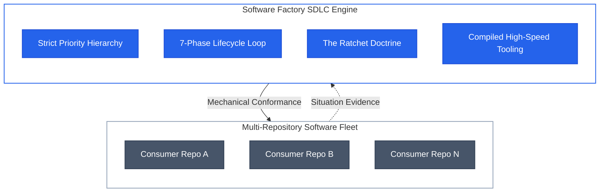
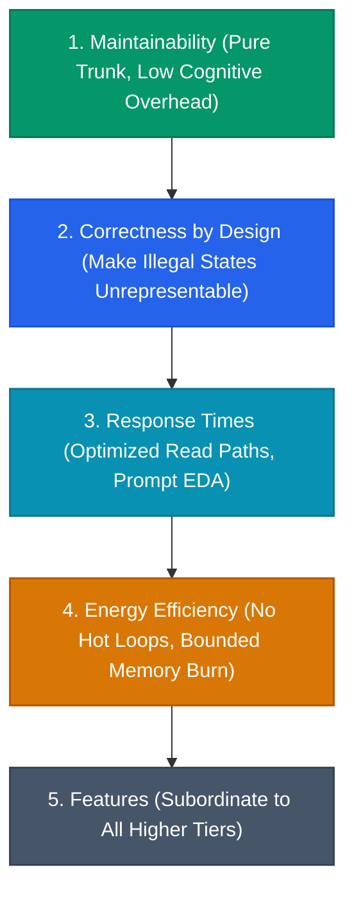
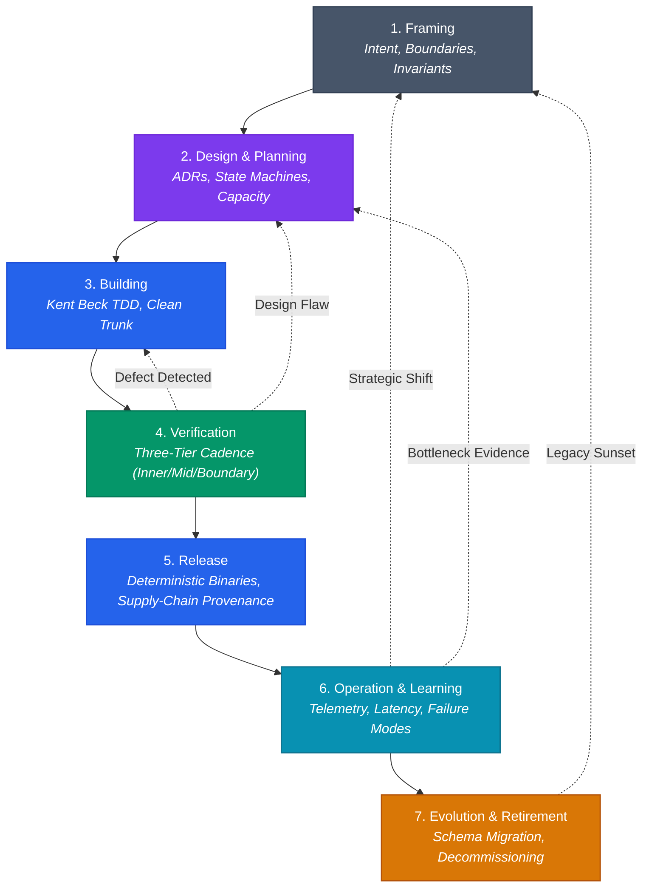
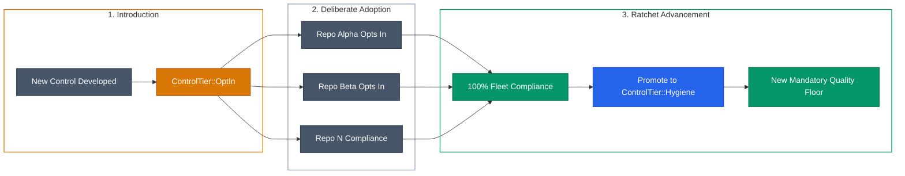
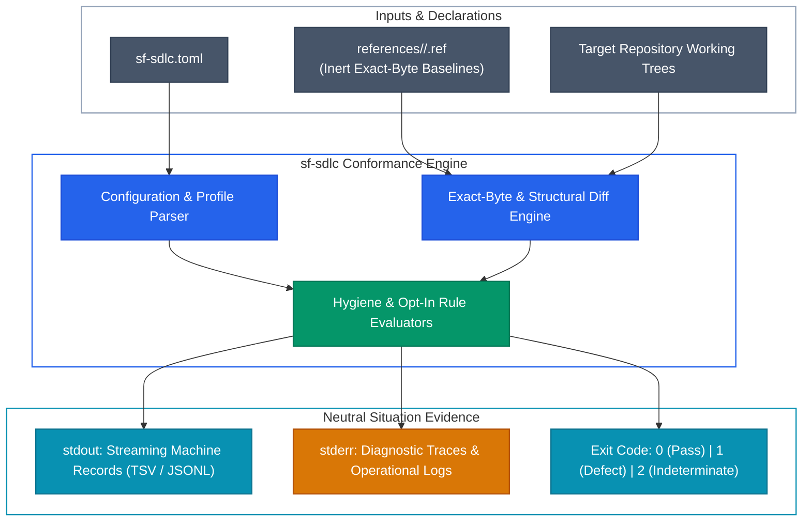
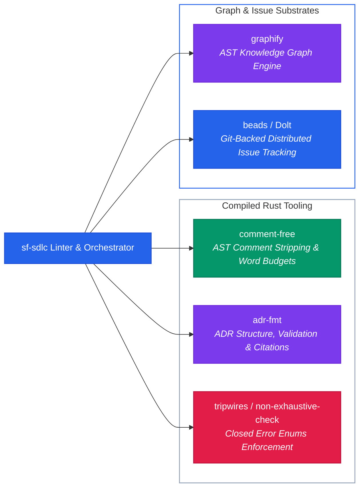

## Software Factory SDLC (sf-sdlc)

Multi-repository software fleets inevitably suffer from structural entropy: architectural drift, divergent dependency baselines, silent quality regressions, and what can only be termed *compliance theatre*. In the absence of an authoritative, mechanically enforced lifecycle, organizational standards devolve into static wiki pages, subjective code review debates, and disconnected audit checklists that teams satisfy symbolically rather than structurally.

`sf-sdlc` establishes a rigorous, normative software engineering lifecycle and an automated quality ratchet designed specifically for modern autonomous agent and human engineering fleets. It defines how software moves from initial intent to retirement, governs technical trade-offs through an explicit priority hierarchy, and enforces baseline hygiene across repositories using high-speed, read-only mechanical checkers.

---

## The Strategic Problem: Fleet Governance vs. Compliance Theatre

Traditional software development lifecycles (SDLCs) fail across multi-repository organizations for three distinct structural reasons:

1. **Epistemic Divergence & Architectural Drift**: As repositories proliferate, individual teams make localized compromises. Toolchains diverge, error handling conventions drift, linter configurations soften, and security invariants erode. Without continuous verification against a shared standard, the fleet fragments into incompatible architectural dialects.
2. **Compliance Theatre**: When organizational standards are defined as narrative policies rather than compiled rules, compliance becomes performative. Engineers write speculative unit tests to hit arbitrary coverage targets, approve pull requests based on familiarity, and maintain documentation that bears no verifiable relationship to the code running in production.
3. **The Fragility of Blanket Enforcement**: When leadership attempts to enforce a new quality standard uniformly across dozens of active repositories, the initiative typically collapses under the weight of broken builds and delivery friction. A top-down mandate either breaks non-compliant services immediately or gets diluted with blanket exemptions that permanently compromise the standard.

`sf-sdlc` replaces narrative policy with compiled, deterministic conformance. Repositories are treated as verifiable state machines governed by exact-byte baselines and monotonic quality gates.

---

## The Strict Priority Hierarchy

When architectural options, resource constraints, or review criteria conflict, `sf-sdlc` mandates an unambiguous, five-tier decision hierarchy. Every engineering decision—from type design to runtime telemetry—resolves strictly in this order:

$$\text{Maintainability} > \text{Correctness by design} > \text{Response times} > \text{Energy efficiency in code} > \text{Features}$$

### Rationale & Trade-off Arbitration

1. **Maintainability (Priority 1)**: Software spend is dominated by long-term maintenance and comprehension costs. `sf-sdlc` mandates pure trunk-based development: work integrates directly onto trunk in small, reversible, independently deployable increments without long-lived feature branches. Simplicity, readability, and low cognitive overhead strictly dominate speculative abstractions or clever local optimizations.
2. **Correctness by design (Priority 2)**: Defensive runtime assertions and scattered conditional checks indicate architectural failure. Correctness must be guaranteed at the type level. Systems must use algebraic data types, closed enumerations, explicit state machines, and private invariant constructors to make illegal domain states structurally unrepresentable. Validation occurs strictly at untrusted input boundaries; once admitted, domain data is trusted unconditionally.
3. **Response times (Priority 3)**: In modern distributed architectures, read latency dominates system utility and user experience. Systems must optimize read-side access paths first. State changes propagate promptly across bounded contexts via Event-Driven Architecture (EDA) and Event Carried State Transfer (ECST), decoupling write ingestion from read queries.
4. **Energy efficiency in code (Priority 4)**: Hardware burn and cloud compute footprint are direct consequences of software design. Code must eliminate redundant polling, idle CPU spinning, unmetered serialization cycles, and unbounded heap allocations. Systems respect explicit resource contracts (bounding concurrent tasks, queue capacity, and heap buffers).
5. **Features (Priority 5)**: New functionality, speculative hooks, and optional configuration parameters rank lowest. A feature is never justified if it degrades maintainability, introduces invalid states into the domain model, degrades read latency, or leaks memory.

---

## The 7-Phase SDLC Control Loop

`sf-sdlc` structures software development into seven continuous, feedback-coupled phases. Each phase defines concrete inputs, verification responsibilities, and unambiguous transition gates:

1. **Framing**: Establish the fundamental intent, operational boundaries, and system invariant definitions before touching code. Distinguishes hard constraints from speculative requirements.
2. **Design & Planning**: Formalize domain interfaces, explicit state machine transitions, and resource contracts. Strategic decisions are committed to immutable Architectural Decision Records (ADRs) via `adr-fmt`.
3. **Building**: Execute implementation through strict Kent Beck test-driven development (TDD: red $\rightarrow$ green $\rightarrow$ refactor). Enforces "one axis of advance" (Tidy First): structural changes and behavioral changes never land in the same commit.
4. **Verification**: Enforce a rigid three-tier verification cadence:
   - **INNER**: Local crate-level tests and clippy checks for rapid TDD loops ($< 5\text{s}$).
   - **MID**: Reverse-dependent closure verification executed prior to sub-mission completion.
   - **BOUNDARY**: Full workspace compilation, all-features test suites under strict timeouts, linting, and formatting executed before epic merge.
5. **Release**: Produce reproducible, cryptographically signed artifacts with full supply-chain provenance (`cargo deny`, `cargo audit`).
6. **Operation & Learning**: Monitor real-world runtime metrics, latency profiles, and failure distributions. Telemetry feeds directly back into framing and design.
7. **Evolution & Retirement**: Manage schema evolution via auditable data migrations, explicit component deprecation, and clean data purging.

---

## The Ratchet Doctrine: Monotonic Quality Floor Elevation

Elevating quality across a multi-repository organization without stalling delivery requires a non-breaking, unidirectional mechanism. `sf-sdlc` achieves this through **The Ratchet Doctrine**.

The Ratchet operates via a two-tier control architecture:

1. **Hygiene Tier (`ControlTier::Hygiene`)**: The mandatory baseline enforced across all repositories in a target classification. Failure to satisfy a hygiene control fails the build immediately. Examples include pinned toolchains, zero compiler warnings (`-D warnings`), closed error enumerations, AST comment hygiene, and supply-chain vulnerability absence.
2. **Opt-In Tier (`ControlTier::OptIn`)**: Forward-looking, high-assurance controls introduced as optional checks. Repositories adopt them deliberately via `opt_in_controls` in their configuration when capacity permits.
3. **Advancement**: A control never enters the hygiene tier directly. It must incubate in `OptIn`. As individual repositories opt in and achieve compliance, the adoption rate is monitored. Once 100% of repositories in a class comply, the control is promoted to `Hygiene`. The ratchet clicks forward: the quality floor rises monotonically, and backsliding becomes structurally impossible.

---

## Delivered Rust Read-Only Conformance Checker

To prevent verification tooling from becoming a source of state corruption, the delivered `sf-sdlc` CLI is engineered as an ultra-fast, read-only conformance engine written in Rust (channel 1.98.0, edition 2024).

### Architectural Guarantees

- **Zero Destructive Mutation**: The checker is strictly read-only. It performs zero in-place file modifications, automated rewrites, or unprompted file synchronization. Write operations require explicit operator authorization and dedicated tooling.
- **Inert Reference Baselines**: Normative reference files (such as operational instructions or configuration templates) are stored within `sf-sdlc` under `references/<target>/<file>.ref`. The checker evaluates exact-byte equivalence between the target repository's files and the canonical reference.
- **Tri-State Exit Taxonomy**: Following fleet doctrine, the tool never folds errors or missing permissions into negative findings:
  - `0`: All assertions passed; target is fully conformant.
  - `1`: Domain defect detected; target violates a hygiene or opted-in control.
  - `2`: Indeterminate or environmental failure (missing files, invalid syntax, I/O error).
- **Stream Separation**: Structured, parseable machine-readable records stream exclusively to `stdout`. Human-readable diagnostic traces, progress indications, and error context route strictly to `stderr`.

---

## The Software Factory Tooling Ecosystem

`sf-sdlc` acts as the orchestrator for a suite of specialized, compiled Rust binaries and structural tools designed to execute in milliseconds:

- **`comment-free`**: A compiled AST-level Rust analyzer. It enforces the fleet's strict "zero plain comments" policy by stripping non-doc comments (`//` and `/* */`) from source code. It additionally acts as a quality gate on public doc comments (`///`), enforcing concise prose budgets (80-word advisory threshold, 120-word hard ceiling) so documentation remains focused contracts rather than wandering prose.
- **`adr-fmt`**: An architectural linter that parses, validates, and cross-references Architectural Decision Records. It guarantees valid metadata, enforces accepted statuses, checks bidirectional markdown links, and traces citations from code back to architectural decisions.
- **`tripwires` (`non-exhaustive-check`)**: A CI gate enforcing the fleet's closed error enum invariant. It mechanically scans public error enums to ensure they do not carry `#[non_exhaustive]`, ensuring that unhandled domain errors remain impossible to construct across semver lines.
- **`graphify`**: A structural knowledge graph engine that extracts syntax trees, call graphs, and module dependencies into a queryable graph (`graphify-out/graph.json`), enabling instant blast-radius calculation prior to refactoring.
- **`beads` (with embedded Dolt)**: Distributed, git-backed issue tracking (`bd`). Retains durable project task tracking, dependency trees, and audit logs locally without external SaaS dependencies.

---

## Fleet Boundary & Consumer Anonymity

A foundational design principle of `sf-sdlc` is **fleet boundary encapsulation**. 

Consumer applications—such as `gh-report` or internal services—are strictly **anonymous members** of the fleet. They consume the standards, run the read-only checker, and implement the lifecycle phases, but their domain-specific requirements never leak back into the definition of `sf-sdlc`. 

`sf-sdlc` remains an unpolluted, domain-neutral governing body. By maintaining this clean separation, the lifecycle rules remain universal, ensuring that any new repository added to the fleet can be immediately onboarded onto the quality ratchet.
