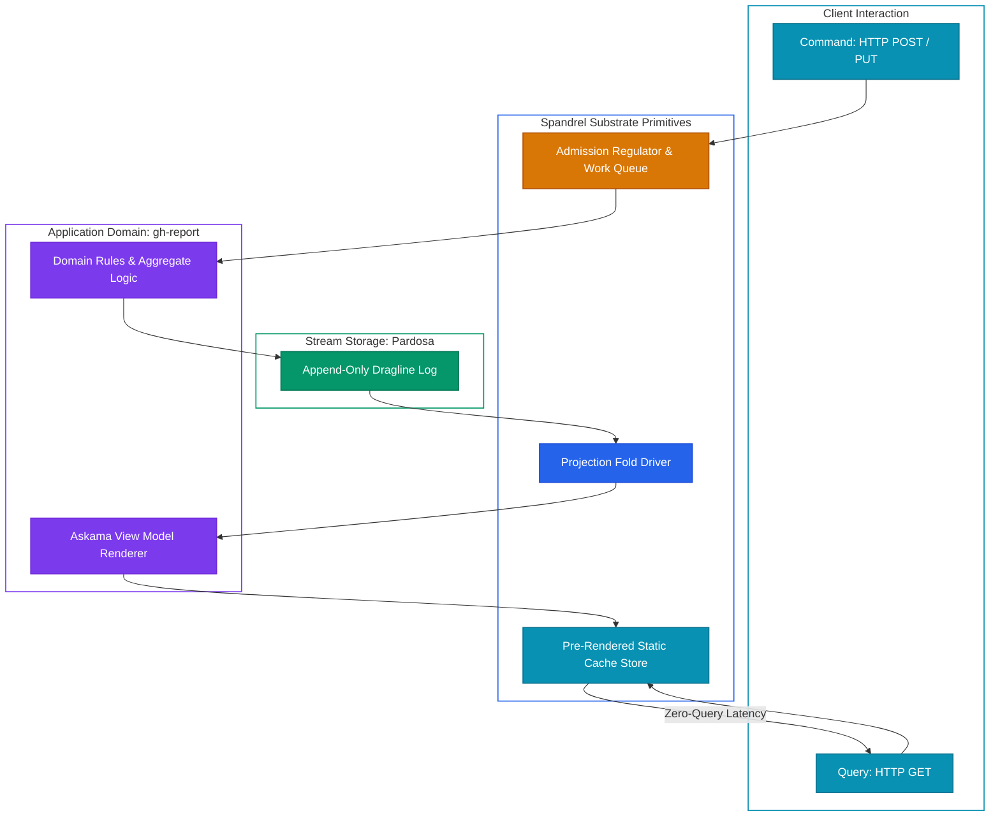
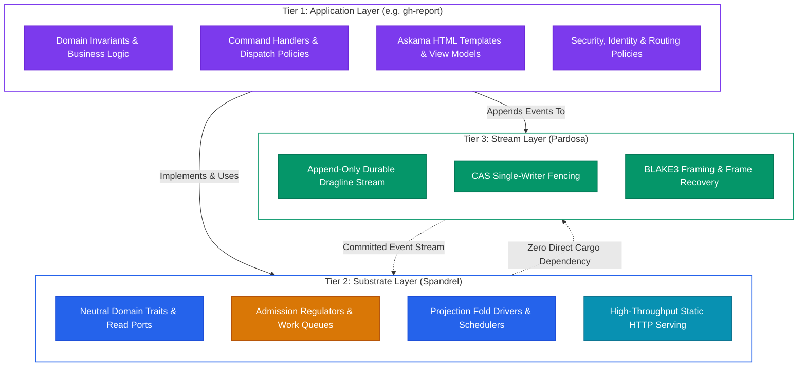
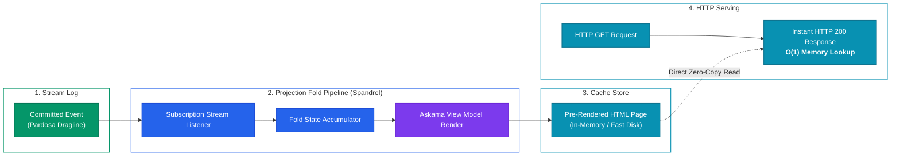

> **Status Notice: Specification & Target Design Phase (TODO)** 
> Spandrel is currently in its formal specification and architectural design phase. It defines the unbundled substrate contracts and neutral domain traits required before implementing production Rust crates. Construction follows clean-room discipline: the specification and neutral test vectors are authored prior to implementation.

## Spandrel: Modular DDD/CQRS/EDA Substrate

Modern web frameworks tend to be monolithic. They bind domain business logic tightly to specific object-relational mappers (ORMs), assume synchronous request-response relational databases, and conflate HTTP request handling with state mutation and view rendering. When engineering teams attempt to adopt Domain-Driven Design (DDD), Command Query Responsibility Segregation (CQRS), and Event-Driven Architecture (EDA) in Rust, they are often forced to choose between heavyweight, all-or-nothing enterprise frameworks or assembling ad-hoc, brittle glue code across dozens of disparate crates.

`Spandrel` provides an **unbundled, modular substrate** for CQRS/DDD/EDA applications in Rust. Rather than acting as an invasive framework that dictates application control flow, Spandrel offers composable, high-performance primitives: neutral domain traits, change-driven projection fold pipelines, admission regulators, bounded work queues, and zero-query static HTTP serving.

---

## The Strategic Problem: Monolithic Framework Coupling vs. Unbundled Substrates

Enterprise application development in Rust faces a fundamental impedance mismatch:

1. **Framework Entanglement**: Mainstream web frameworks encourage embedding business invariants directly inside route handlers, database transaction blocks, or template engines. When data models evolve or deployment targets shift from servers to edge daemons, the entire application stack must be rewritten.
2. **The Query-at-Request Anti-Pattern**: Traditional web services query the database dynamically upon every incoming HTTP GET request. As data complexity grows, requests trigger expensive join cascades, relational locking, or distributed cache invalidation bugs. Even with Redis or Memcached, query latencies degrade under load.
3. **Lack of Composable EDA Building Blocks**: In the Rust ecosystem, while high-performance networking (`tokio`, `hyper`, `axum`) and fast templating (`askama`) exist as isolated libraries, there is a lack of cohesive, unbundled primitives for folding event streams into pre-rendered read views with explicit resource bounds.

Spandrel resolves this by unbundling application infrastructure into clean, autonomous tiers.

---

## Three-Tier Separation of Concerns

Spandrel establishes a strict, three-tier separation of concerns across the application architecture:

1. **Application Layer (e.g. `gh-report`)**:
   - Owns domain business rules, domain commands, and state validation.
   - Defines concrete Askama HTML templates and typed view models.
   - Declares authentication, authorization, and endpoint routing.
2. **Substrate Layer (`Spandrel`)**:
   - Provides domain-neutral interfaces: read ports, entity identifiers, and event descriptors.
   - Implements resource-bounded admission regulators and priority work queues.
   - Drives projection fold pipelines, coordinating the transformation of stream events into state.
   - Manages high-performance HTTP serving directly from pre-rendered memory or disk buffers.
   - **Zero Dependency Guarantee**: Spandrel core crates maintain zero direct Cargo dependencies on Pardosa or specific storage engines, ensuring complete technological decoupling.
3. **Stream Layer (`Pardosa`)**:
   - Acts as the immutable, append-only commit log.
   - Provides per-aggregate linearizability via Compare-And-Swap (CAS) single-writer fencing.
   - Guarantees byte-level frame integrity via BLAKE3 checksums and crash-safe file flush protocols.

---

## Change-Driven Projection Fold Pipeline

The core architectural flow in Spandrel is the **Change-Driven Projection Fold Pipeline**. It eliminates runtime database querying by turning page rendering into an asynchronous, change-driven event fold:

### The Four Pipeline Stages

1. **Stream Ingestion**: When an aggregate mutation commits to the stream layer, the event is emitted to subscribed listeners.
2. **State Folding**: Spandrel's projection driver routes the event to registered fold accumulators. The accumulator updates its typed in-memory projection state deterministically.
3. **Static View Rendering**: The updated projection state triggers immediate rendering through the application's compiled Askama template. The resulting static HTML page is published to an optimized cache store (in-memory buffer or memory-mapped file).
4. **Zero-Query HTTP Serving**: When an HTTP GET request arrives from a user or browser, the HTTP serving layer fetches the pre-rendered artifact directly from cache. **Zero database queries, zero template rendering, and zero locks occur at request time.** Serving achieves predictable $O(1)$ read response times under arbitrary traffic load.

---

## Invariants & Demarcation: Guarantees That Hold

Distributed systems require precise semantic boundaries. Spandrel formalizes critical demarcation invariants and resource safety contracts:

### 1. Ingestion Demarcation: Acceptance $\neq$ Completion $\neq$ Commit

Spandrel strictly enforces three distinct lifecycle checkpoints for all command mutations:

$$\text{Acceptance} \neq \text{Completion} \neq \text{Commit}$$

- **Acceptance (HTTP 202 / Enqueue)**: The command has passed admission regulation and entered a bounded work queue. No state mutation has yet occurred.
- **Completion**: The domain aggregate has executed business logic, validated invariants, and produced candidate events.
- **Commit**: The event has successfully been appended to the append-only stream log with CAS fencing and flushed to disk. Only committed events are observable by projection folds.
- **Reconciliation of Unknown Outcomes**: If a network disconnect, process restart, or timeout occurs during stream append, Spandrel treats the outcome as **Indeterminate**, never assuming failure. The subsystem initiates reconciliation against the stream rather than issuing duplicate mutations.

### 2. Explicit Resource Contracts (FLEET-RES-01)

To prevent resource exhaustion, Spandrel components enforce explicit resource bounds:

- **Separate Accounting for Items and Heap Bytes**: Bounded channels alone do not bound memory. A queue holding 100 small messages consumes kilobytes; holding 100 multi-megabyte payloads exhausts RAM. Spandrel accounts for item count and allocated payload bytes independently.
- **Admission Regulation & Backpressure**: When queue item or byte capacity reaches maximum thresholds, incoming commands are shed with explicit backpressure (`HTTP 429 Too Many Requests` or `HTTP 503 Service Unavailable`).
- **Supervised Shutdown & Cancellation**: Dropping asynchronous task handles does not guarantee task termination. Spandrel utilizes cooperative cancellation tokens, ensures in-flight tasks drain within explicit timeout budgets, and releases all permits deterministically via RAII guards.
