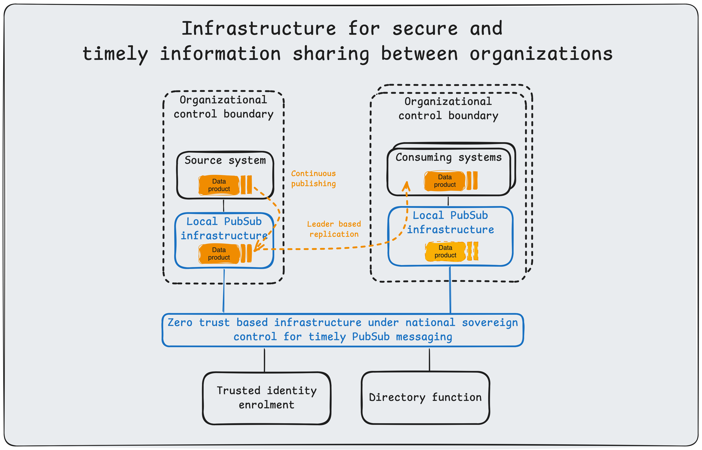
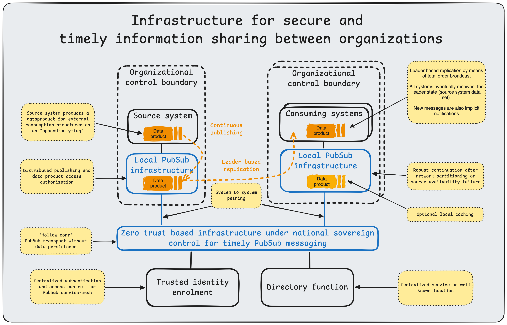
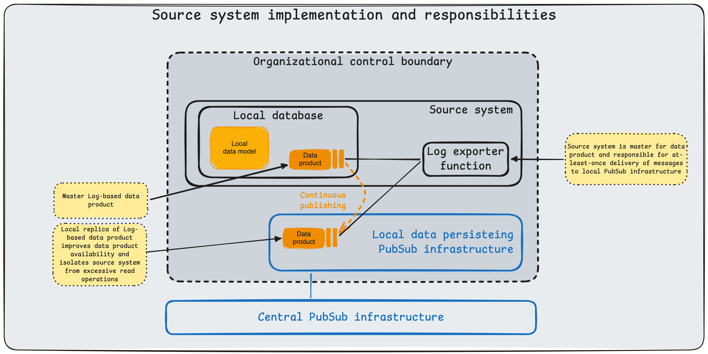

## Reliable Data Product Distribution

This article describes a secure, cross-organizational platform for timely information sharing. It focuses on a specific integration pattern, typically referred to as data replication or data propagation. Other integration patterns, such as request-response, are out of scope.

## A Common Challenge

When asked, "How can we share this information with X?", technical leads, architects, developers, and administrators invariably respond with: "What are the requirements?" That follow-up question is rarely answered fully. Stakeholders often have vague or conflicting priorities around performance, completeness, correctness, security, maintenance, and budget. The implementers may also not have insights or available resources to solve for all requirements. The design presented here addresses these technical requirements holistically, leaving budget as the primary variable and reducing total cost through economies of scale.

## Requirements

See [security]() for details on how this article defines security qualities.

**Defense-in-depth.** Both source and destination systems must be shielded from common internet-based attack vectors. Endpoints must be protected from direct public internet access.

**Workload mobility.** Services must remain decoupled from infrastructure dependencies such as IP addresses or specific network topologies. This abstraction enables seamless migration across on-premises, cloud, and hybrid environments without code changes or service disruption.

**Security: Availability.** Availability of the system as a whole must be protected such that inevitable system and network disruptions are isolated and prevented from cascading to other systems.

**Security: Integrity.** Ensure the correctness and completeness of each data product.

**Security: Authenticity.** Strong authentication of every producer (source) and consumer (destination).

**Security: Control.** A central motivation for this system is to enhance national digital sovereignty. Therefore it must be deployable and operated under national control.

**Timely delivery.** Applications often require up-to-date information. Daily batch transfers may introduce unacceptable latency.

**Bandwidth efficiency.** Repeatedly transferring full datasets (for example, nightly dumps) is computationally expensive and bandwidth-intensive ($O(n)$ where $n$ is dataset size). An efficient system should transmit only state changes (deltas), reducing complexity to $O(\Delta)$ proportional to the rate of change.

**Data discovery and schema validation.** Data is of limited value if it cannot be found or understood. The platform must provide a catalog for discovery and enforce schema validation to ensure semantic interoperability across decoupled systems.

**Completeness and correctness.** Ensuring data consistency between source and destination is a fundamental challenge in distributed systems. As established by the CAP theorem (Brewer), a distributed data store cannot simultaneously provide more than two of the following guarantees: Consistency, Availability, and Partition Tolerance. Given the physical inevitability of network partitions and latency (bounded by the speed of light), a system prioritizing high availability cannot guarantee strong consistency (linearizability) at all times.

Therefore, we design for _eventual consistency_, a model where the system guarantees that if no new updates are made to a given data item, eventually all accesses to that item will return the last updated value. This approach decouples the source from the destination's availability, ensuring system resilience.

To achieve this state convergence reliably, we implement _effectively-once processing_ (often referred to as _exactly-once semantics_ or EOS in stream processing) by combining two mechanisms:

1. **At-least-once delivery:** The transport layer guarantees that every message is delivered to the destination one or more times. This handles network failures where acknowledgments may be lost, necessitating retransmission.
2. **Idempotence:** The consumer application is designed to handle duplicate messages safely. Using mechanisms such as unique identifiers or deterministic state transitions, processing the same message multiple times yields the same side effects as processing it once.

Together, these mechanisms ensure the destination dataset mirrors the source without duplication or data loss. In _Designing Data-Intensive Applications_, Martin Kleppmann refers to this pattern as _leader-based replication_, where the source system acts as the leader responsible for writing and broadcasting state changes to follower systems.

## Characteristics of the design

To satisfy the stringent requirements outlined above, the system architecture is built upon **NATS**, a high-performance cloud-native messaging system for transportation of data products. The architecture further specifies responsibilities of producers and consumers as well as patterns to ensure completeness and correctness of the consumed data product.

**Defense-in-Depth (Leaf Nodes).** To meet the requirement for isolating endpoints, we employ NATS Leaf Nodes. A Leaf Node runs locally within a secure enclave and initiates an _outbound_ connection to the central NATS cluster. This architecture requires no inbound firewall ports to be opened on the secure network, significantly reducing the attack surface while safely extending the messaging plane into restricted environments.

**Defense-in-Depth (Hollow core nodes).**
At the center of this architecture is the NATS server service-mesh connecting every participating organization. These servers provide robust scale out capability and should be protected from DoS attacks by lower layers of network infrastructure.

**Workload mobility.** NATS decouples producers and consumers through subject-based addressing, so services can move across edge, on-premises, and cloud environments without endpoint reconfiguration. With leaf nodes and distributed routing, workloads remain portable and resilient to intermittent connectivity while preserving continuous data flow.

**Secure: Availability.** To optimize availability, we use NATS JetStream to provide _at-least-once delivery_ and source-independent availability of data products across the service mesh. JetStream persists messages to disk as an immutable log of state changes. This ensures that even if a consumer is offline for an extended period, it can replay missed messages upon reconnection and recover full dataset state without data loss. The central architectural trait underpinning dataset replication is loose coupling, which reduces the shared-fate problem of tightly coupled systems. Consuming organizations may optionally cache selected data products locally to get better availability and handle particular performance needs such as multiple consumers or frequent restarts with complete data product consumption.

**Security: Integrity.** Integrity is reinforced through immutable JetStream event logs and controlled message handling semantics, reducing the risk of undetected data corruption during transport and replay.

**Secure: Authenticity.** We enforce the authenticity requirement using NATS account-based multi-tenancy with decentralized authentication (NKeys) and granular authorization. Account isolation ensures that organizations can share infrastructure without accessing each other's data streams, preserving the principle of least privilege.

**Security: Control.** The platform can be deployed and operated in nationally controlled environments, with local ownership of infrastructure, identity, authorization policy, and retention controls.

**Timely delivery.** JetStream enables low-latency propagation of state changes using push delivery for online consumers, minimizing delay compared with periodic batch exchange.

**Bandwidth efficiency.** To optimize _bandwidth efficiency_ and _timely delivery_, JetStream supports both push and pull consumption models. Real-time updates are pushed to active consumers immediately, minimizing latency. Conversely, batch processes or bandwidth-constrained consumers can pull messages at their own pace, preventing flow-control issues and optimizing resource usage.

**Data discovery and schema validation.** Data products is published with discoverable subject conventions and documented contracts, while schema validation at producer and consumer boundaries enforces semantic interoperability. This can be done through either a well known repository or a service.

**Completeness and correctness.** The design achieves convergence through _at-least-once delivery_ with idempotent consumption, allowing destination systems to replay missed events and reach eventual consistency without duplication or loss.

## Necessities for a robust national information-sharing infrastructure

To escape the cycle of recurring systemic failures and strategic dependency, we must rethink our infrastructure through the lens of high-reliability theory. As Ken Thompson demonstrated in _Reflections on Trusting Trust_ (1984), a system's security is illusory if the tools used to build it are compromised; therefore, verified provenance in our software supply chain is a prerequisite for trust, protecting against the kind of hidden fragility Nassim Taleb warns can lead to catastrophic collapse in _Antifragile_. This technical autonomy is inseparable from political agency. Shoshana Zuboff’s analysis in _The Age of Surveillance Capitalism_ suggests that ceding infrastructure to hyperscale monopolies is not merely an outsourcing decision but a surrender of governance, necessitating a shift back to hosting environments where the organization retains full jurisdictional control.

Conceptually, we must accept Charles Perrow's thesis in _Normal Accidents_ that failure in tightly coupled systems is inevitable. Rather than striving for impossible perfection, we should emulate High Reliability Organizations (HROs) by designing for resilience and rigorous operational vetting. This requires a departure from monolithic architectures toward the "share nothing" principles of Carl Hewitt’s Actor Model (1973). By isolating components in a manner that prevents the "accidental complexity" of shared state described by Fred Brooks, and strictly enforcing Saltzer and Schroeder’s principle of _Least Privilege_ (1975) through capability-based interfaces, we can construct systems where individual faults are contained, preventing minor errors from cascading into national crises.

## More to Read

- [Digital Sovereignty]()
- [Fiber semantics. Event sourcing for complex domains (Repository)](https://github.com/acje/Fiber-semantics)
