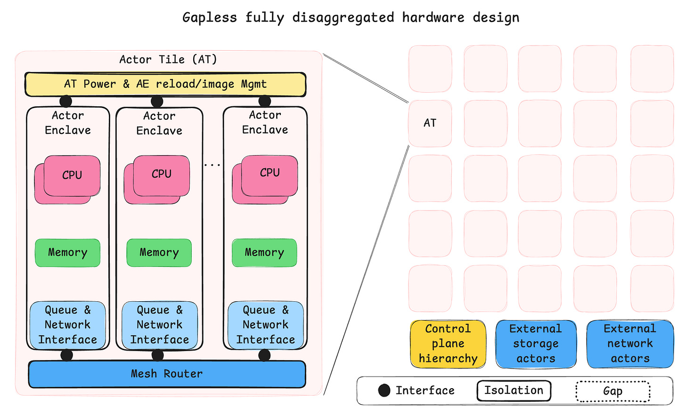
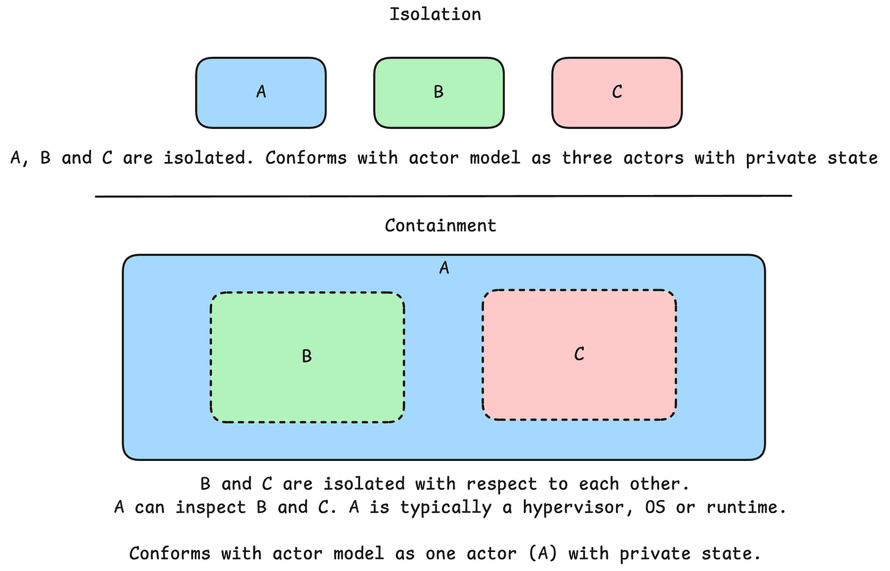
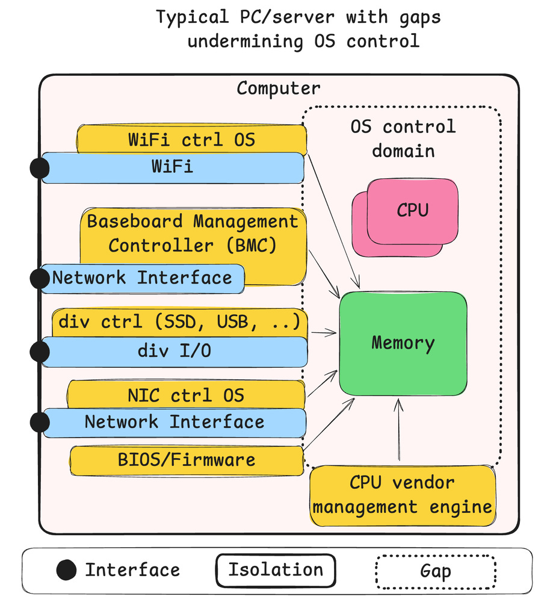
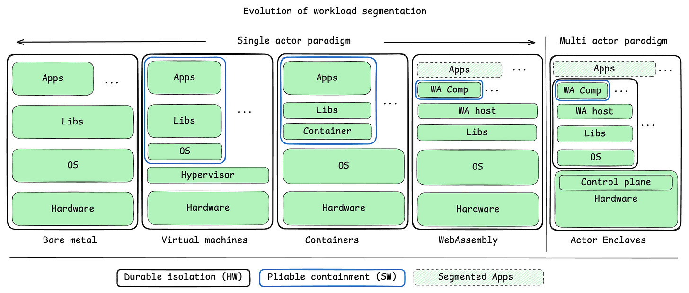

## A new compute stack

There are times when the world gets tight and choices grow sharp. This is one of those times. The machines we depend on are not neutral now; they shape power, trust, and freedom.

One reason we miss this is paradigm blindness, the structural failure.[1] Experts are trained to solve puzzles inside the accepted frame. They get very good at normal work and bad at seeing that the frame itself is the problem.

This essay starts in that atmosphere and goes down into the metal. It moves past slogans and policy talk and looks at what is built, what was inherited, and what can fail. The current stack did not arrive by fate; it came from bargains, habits, and fear of breaking what already runs. What follows argues for another path: keep complexity on a short leash, treat interfaces as commitments rather than fashion, and build isolation that holds when pressure comes. From motive to method, from diagnosis to design, this is a map for the work ahead. The concrete adversarial protagonist in this analysis is a state-sponsored advanced persistent threat (APT): patient, well-resourced, and optimized for long-term leverage.

- [Chapter 1 — Geopolitics, security, trust and transparency](#chapter-1--geopolitics-security-trust-and-transparency)
- [Chapter 2 — Strategic contract](#chapter-2--strategic-contract)
- [Chapter 3 — Ossified foundations and a clash of two worlds](#chapter-3--ossified-foundations-and-a-clash-of-two-worlds)
- [Chapter 4 — Isolation is all you need](#chapter-4--isolation-is-all-you-need)

## Chapter 1 — Geopolitics, security, trust and transparency

### Introduction

Here is why and how we can create a new technology stack, a tale about computer architecture and geopolitics in four parts.

It is February 2025, and the MAGAs are running the White House according to Steve Bannon’s “muzzle velocity strategy,” or “wrestling,” as historian Stephen Kotkin aptly characterizes this fourth-power distraction strategy. The Trump-Vance administration is doing wonders to awaken a sleepy and confused Europe. As a European, I can’t help but welcome this development to some limited extent. I’m certainly happy Putin isn’t doing all the heavy lifting on his own. The side effects of the tools in his toolbox are simply too horrendous.

Europe, not just Germany, has been a naïve consumer of Russian energy, Chinese labor, and American security, again according to Kotkin, and I get the feeling that this is popular opinion in the US in general. For various reasons, these are now all in short supply. The end of free-riding on Chinese labor is mostly a loss for China's strategic positioning in the global supply chains, even if some goods will get more expensive. And as with Russian energy, it is sort of a self-inflicted supply issue founded on what should by now be obvious strategic concerns about unhealthy dependency on adversarial regimes.

Authoritarian regimes have a common dysfunction: they are not very good at delivering sustained prosperity for their own populations. China may seem like a counterexample if you only value money, but the growth can be explained by a free ride on Western capitalists selling out the working and middle class through otherwise somewhat useful globalization. Once the hope of upward socioeconomic mobility for the masses in an authoritarian regime has faded, the need for an external enemy becomes salient. The dictator now needs to find a promising conflict to escalate.

### “Et tu, Brute?” The dangers of alternatives

Liberal democracies unfortunately become the authoritarian leader’s obvious choice of enemy for two reasons; number one, liberal democracies provide a credible alternative, which is above all the most life-threatening concept for any authoritarian leader. Second, a liberal democracy does not react aggressively to harassment at first. They function more like a pressure boiler and less like a bully, as other authoritarian regimes do. Unfortunately, pressure boilers have a very non-linear response; once the stressors reach a critical threshold, strategy and alignment become simple, and the creative but unaligned and often confused liberal democracy becomes lethal. It’s like putting a magnet near iron filings. All the unaligned entities suddenly self-organize in a way that was not possible to discern before the external force significantly interacted with the liberal democracies.

This is initially not a concern for the authoritarian leader looking for a suitable target to bully in the beginning of his [sic] inevitable peril with this downward spiral. This is why liberal democracies can't have deep peace anymore in the current world configuration. And this is why we must get our deterrence in shape by every means possible, or risk having to fight World War Three. Those are the stakes.

### The significance of computer architecture

Computer architecture is not going to be at the very cutting edge of deterrence, but it is going to be in everything, and a lot of it will have to be online and available to everyone. Trust and transparency are large defining parts of who we are, and we cannot afford to lose who we are just to win. Further, one of our strategic advantages is in wide-reaching, high-trust alliances, which are not very amenable to closed or air-gapped systems. This is why we need a new technology stack for our compute needs that can substantially shift the cyber battlefields in favor of the defenders. In military parlance, this is about surfaces and gaps. Surfaces are prepared defensive lines; gaps are a lack of such structures. In part three, we will identify some gaps that we have so far failed to close in our compute systems.

To sustain a relevant economic presence, which again is the basis for sustained deterrence, we would also need a new compute stack to be fast and energy-efficient. And to compensate for the lack of a huge FAANG SRE (administrator) talent pool outside the state of California, we are also in need of a technology stack that can shed the layers of accidental complexity inherent to our current systems. Of course, such a capability is not something only liberal democracies can gain from, but for smaller states seeking digital sovereignty this is not just a nice-to-have, it is a need-to-have.

### Summary

To sum it up, a low-complexity, secure, and fast compute stack is a need-to-have for digital sovereignty and sustained deterrence. Part two lays out the high-level strategy, part three examines the nature of the problem, and part four identifies some key tactical capabilities of a design.

I do not have references for the claims found here, but if you want inspiration from some of the people who have informed my opinions, I recommend looking up Stephen Kotkin and Sarah C. Paine.

## Chapter 2 — Strategic contract

### The kernel of a strategy

*“The kernel of a strategy contains three elements: a diagnosis, a guiding policy, and coherent action.”* – Richard P. Rumelt

How did Nvidia outcompete Intel on high-performance compute? The following three factors were certainly important to Nvidia’s success: first, a software-based contract (CUDA) to reduce the rate of platform ossification; second, a vastly shorter development cycle time; third, riding a wave together with TSMC as the “economy of scale”-driven semiconductor industry forced capacity consolidation and gave Nvidia access to the most energy-efficient transistors available.

Creating a completely new hardware and software technology stack from the ground up is hard. Creating one that is attractive to use in a data center environment is pretty much impossible even with decades and billions to spare. Now demand this new shiny object to be faster, more secure, and simpler to operate. That is safely within the realm of pipe dreams. So how do we achieve the end goal without starting from scratch? This is the crux.

### Policy

A policy to implement a strategy may look like this:

1. Commit to a contract (this is analogous to how the EU pushed for USB-C)

   1. The contract must be possible to integrate into existing systems
   2. The contract must be public
   3. There should be several implementations of the contract
2. Optimization follows stabilization of the contract; implementations that optimize ahead of stabilization cannot expect their sunk cost to be valued.
3. Identify and extract capabilities that must be protected from adversarial modification, such that they can be implemented without the ability to change. In concrete terms this means assuming a state-sponsored APT can eventually compromise software layers. Hardware support for isolation is an obvious candidate here.

Identifying a suitable software-based contract resembling something like a distributed runtime for general-purpose compute needs that is capable of delivering our three identified needs would create a possible route of many small steps to a new hardware and software stack, with this contract sitting in the middle and providing opportunities for simplifications and innovations both above and below the contract.

For brevity, I will skip diagnosis in this part and jump to the conclusion by laying out what this contract could look like. I plan to show through examination of the problem and corresponding design that a strategic contract purposefully tailored to achieve the three stated goals of low complexity, security, and speed can be crafted with a combination of WebAssembly components and the actor model as a foundation.

Next follows a short description of both concepts and how their inherent characteristics are meant to contribute toward the goal of the contract.

### The actor model by Carl Hewitt

The actor model by Carl Hewitt is a model of distributed computing that defines actors as the unit of compute. Actors have private state and an interface to receive messages from other actors. When creating a strategic contract, the actor model provides the fundamental framework for arbitrary homogeneous scale, closes some gaps in our surfaces, and even provides a mechanism to deal with a hardware-scaling issue known as the von Neumann bottleneck, or more generally the memory wall. There are several actor model frameworks around today that have shown unmatched capabilities in high-performance and high-availability systems. This holds particularly true for the Erlang lineage of systems created by Joe Armstrong. These systems were initially inspired by Tandem NonStop but managed to be vastly cheaper and more flexible by implementing the actor model as a software runtime on top of commodity hardware.

### WebAssembly

WebAssembly is an ecosystem of virtual-machine-related technologies that importantly delivers the ability to verify that code is properly sandboxed and describe interfaces in terms of capabilities. When creating a strategic contract, WebAssembly and the related WebAssembly component model provide support for multiple languages (polyglot), a compile target, and the possibility to design least-privilege interface contracts.

To handle risk and development speed we have learned through the practice of DevOps and product management that short development cycles are key to success. What if we could make a software-emulated version of the best imaginable machine, deploy it to production at large scale to get feedback, and iterate fast over its development. We could get rid of much of the accidental complexity accumulated over the past five decades since x86 (1978) introduced the model we generally run today. This model was later effectively cemented into place by the popularity of operating systems like Linux (1991) and Windows.

Such a software-emulated version of a computer that implements WebAssembly and the actor model by giving every component an address to send messages to exists today. Enter WasmCloud, an actor-model-based WebAssembly runtime that uses WASI for interface contracts. I should probably mention that I’m not affiliated with WasmCloud in any way, other than having loosely followed the project for some time because it ticked all the right boxes.

However, I’m not going to describe WasmCloud here, or even praise some of its wonderful features. Instead, we are going to look at how a similar vehicle can help us get to a next paradigm of compute that can deliver our needs for a low-complexity, secure, and fast compute stack.

## Chapter 3 — Ossified foundations and a clash of two worlds

*“If I had an hour to solve a problem, I'd spend 55 minutes thinking about the problem and 5 minutes thinking about solutions.”* – Albert Einstein

### The sorry state of InfoSec

A lot of IT and InfoSec professionals agree that we are in a sorry state with regard to security in our information systems. If you feel this is hyperbole, then you might entertain the idea that localized bugs in software components often risk causing loss of system control in the form of remote code execution (RCE). It doesn’t have to be this way if we design systems defensively from the ground up, but this is not the kind of system that has emerged as a dominant computer platform yet. Understanding how we got here is key to understanding how we can change course.

### The reactive InfoSec Industry

For part three, I have been contemplating splitting it into the IT and InfoSec industries, but I couldn’t come up with any real impact the InfoSec industry has had on inherent security in our systems, so I’ll just briefly mention it. There is a reasonable set of processes in InfoSec: identify, detect, protect, respond, recover, and govern that is thoroughly documented. There is unfortunately a very weak idea about what security qualities these processes should be striving to achieve. Notably, the three security qualities—availability, integrity, and confidentiality—dominate in the most industry-shaping security frameworks: ISO 27000-series and NIST CSF. Both these frameworks fail to include the most important security quality from the Parkerian Hexad: the control quality. The frameworks also largely miss the opportunity to create a systemic view including authenticity and utility. It is difficult to see how you can achieve anything of real security value if you fail to consider the control quality. Contrarily, we may consider that “control is king,” because any entity that can exert complete or partial control of a system can likely influence all the other qualities of this system in the future. Hence, not considering the control quality is a complete failure of the ability to even reason about security, but this is unfortunately the current state of InfoSec. Further, there is no concept of surface, gap, and interface analysis in these security frameworks. This is why the huge InfoSec industry isn’t really a player in shaping inherent system security today. All the processes and organizational structures are retroactively working on systems already deployed and will not make your next system any more inherently secure. If you want to look up where these security qualities originate, look up the “Parkerian Hexad.” Understand what each quality entails and you’ll be able to baffle most security professionals out there.

### The ossified IT industry

Let’s get to the meaty part. The IT industry is clearly divided into two very different domains with very different incentive structures. There is the hardware industry, most notably driven by economies of scale, causing a winner-takes-all tendency, but also a strong leaning toward flexibility and ease of use or entry, and perhaps most importantly, backward compatibility, because you need to maximize the size of your target market to be the winner. The hardware industry was the main game in town in the first few decades, and in this period it produced several novel designs with strong security features like rings, capabilities, and separate failure domains. These days things have changed. Users follow functionality, which is defined in software. Software is picking the winners among hardware alternatives, and it is heavily incentivizing backward compatibility, leading to a very narrow lane to stick within for hardware designs to have a chance to succeed.

The software industry started out with incentive structures similar to the hardware industry, with its “shrink-wrapped” software delivery model on storage media like discs and later CDs and DVDs, but this model has now been replaced by services, app stores, and perhaps most importantly, open-source repositories. The way we build software has now become an economy of composition. This composition is the main driver of software productivity, but it also brings some structural challenges.

Picture the current technology stack as a large tower, or even more like an upside-down pyramid. There are millions of workers adding, removing, and changing pieces to the structure all the time, but the rate of change only stays high at the ever-growing top of this upside-down pile. Once a layer has become buried under a couple of higher layers, it becomes ossified. The rate of change drops dramatically at these buried layers, and only certain interior aspects of the pieces in these layers can now easily be changed. Any change to the exterior of a piece becomes a huge, entangled project with multiple parties that may not share situational awareness or agree on strategic goals. At the lower layers you find hardware with its CPU ISA that can only grow, never shrink, and never change structural shape or fundamental behavior. Above the hardware, that is in the middle of this upside-down pyramid, are the lower layers of libraries, operating systems, and protocols for storage and communication. All these mid and lower layers are so constrained by network effects that they tend to be ossified for years or decades with minimal change. Not because they are done or perfected, but because the cost of change is no longer seen as short- or midterm affordable by the parties of interest.

### A clash of two worlds

There is a clash of two worlds in the IT industry. It is the hardware economy of scale and the software economy of composition working against each other to reduce the space of opportunity. Hardware creates a small number of possible winners, and software picks the cheapest, fastest, least common denominator that maintains backward compatibility. What we are left with is a fast and flexible, but inherently insecure, hardware and software technology stack. A thick upper layer of software gives the false impression of a fast-moving IT industry, but it is only moving fast on the surface, while being completely ossified in its own lower layers of software and hardware.

To understand how this could be much different, I think it is best to start at the bottom and work our way up. At the very bottom lie the real trade-offs forged by the laws of physics. To quote Jim Keller: “Hardware is just a bunch of pipes and arrays.” What the unfortunate dance between hardware and software has created is a need to scale up the complexity of the pipes and the size of the arrays. In other terms, we made the CPU cores faster but less energy-efficient, and the memory hierarchy, that is, the caches and RAM, larger, which again means higher latency and less energy-efficient operation. This was done so that software didn’t have to change, because that has always been the winning recipe for the hardware industry. Now the free lunch in CPU scaling is over, so we started adding more CPU cores to the same memory hierarchy. This means the memory size must grow to keep enough work close to the CPUs, which makes memory have even higher latency, which means the CPU cores must be designed even more aggressively to hide the memory latency. This is a downward spiral even from a pure performance perspective. Keep in mind that we are completely bound by heat density by now. Any addition that reduces energy efficiency is a net loss for most workloads. Sure, you can find some highly serialized workloads that benefit. There are no easy answers here.

### Shared memory as a back channel

However, this piece was supposed to be about security, and there is another insidious consequence of this ever-growing memory hierarchy. Memory isn’t just information storage; it is also a communication channel. Sometimes it is a communication channel on purpose, like when concurrent elements of a program pass messages to each other by means of data structures in memory rather than messages over a network. But there is also the huge class of bugs that allows adversaries to exploit either memory safety errors or privilege escalations to create unintended communication channels to other parts of our systems that themselves may not have any bugs that are exploited in this scenario. This runaway cascade of consequences from relatively small bugs is a structural deficiency in our systems, and unless we can find a way to write bug-free software and hardware, we need to curb these cascading failures. I wouldn’t hold my breath. Formal verification has proved to be almost impossible for anything but the tiniest pieces of software.

### The memory wall

The performance issue created by ever-growing strain on the memory system is sometimes called the von Neumann bottleneck and sometimes the memory wall. And as I have shown here, it also enables several failure modes that could otherwise have been eliminated if we could find a way to disaggregate the memory hierarchy into small, isolated islands and replace all the intended communication channels through memory with low-latency, energy-efficient explicit message passing over a network. This, however, would break all existing software and hence such hardware would never be picked by the market as a winner. Unless, of course, we either created such a market, or perhaps didn’t make the machine in hardware at all, but instead built the strategic contract from part two in software for the first generations and later implemented parts in hardware.

### Software has a credible commitment problem

We need to examine some more problems to understand why we eventually need to implement parts of such a machine in hardware rather than software, and beyond the obvious performance gain in message passing, there is another less obvious aspect that is best described by going back to where we started, with geopolitics. Software has a credible commitment problem. This matters most when the adversary is a state-sponsored APT that can sustain campaigns over years and optimize for future coercive leverage. What is a credible commitment problem, one may ask. Well, like with the “control is king” statement above, it has to do with time; the future, more precisely. The credible commitment problem is about an entity’s ability to guarantee something in the future. And when connecting this problem to software, we are simply pointing to the fact that the one big advantage of software is also its weakness in this specific situation. Software’s ability to change is directly connected to software’s inability to guarantee that it will not change in the future. Remember Chinese 5G networks? They claimed it was verified without any backdoors. And that was probably accurate. But if you fundamentally don’t trust the supply chain, there is no reason to trust that a backdoor will not be added in the future, even if it is not present today. To leverage this insight in future designs, we need to identify invariants that are important to guarantee security and implement those in hardware or at least with sufficient hardware support to establish credible commitment. One such candidate will be isolation mechanisms when disaggregating the memory hierarchy.

For more information on this topic, the ACM Turing award lectures by Hennessy and Patterson, in particular the section about “the sorry state of security” is a good place to start.

## Chapter 4 — Isolation is all you need

*“Everything should be built top-down, except the first time.”* - Alan Perlis

This succinct statement explains how we would deal with the complex adaptive domain and transition our understanding to the complicated domain of the Cynefin framework, allowing us to eventually optimize solutions to problems that are initially riddled with both known and unknown unknowns. In part four I will look at the importance of isolation to shift the cyber battlefields in favor of the defenders. It is obviously not all we need to build secure systems, but in this age of AI the reference to "Attention is all you need" was just too tempting.

### A short recap of what we have covered so far

Part one: Motivated the need for more secure and less complex online systems. It is a need-to-have if operated outside China or California because of limited resources. This may include autonomous systems and online services.

Part two: Identified a possible strategy for future defensible information systems that significantly shifts the cyber battlefield in favor of the defender by isolating failure domains. The strategy is designed to allow for an incremental approach, but still requires some risk-taking in terms of first building up software runtimes that may suffer some performance overhead and software-based isolation mechanisms, and later the need to invest in hardware/software co-designs that eliminate these trade-offs but also break backward compatibility with software that has not been ported to these new WebAssembly- and actor-model-based systems.

Part three: Delved into the problem at hand and identified the incentive structures that led us to where we are today. Further, we looked at the need to establish low-overhead communication and credible isolation through hardware mechanisms and briefly introduced a model of surfaces, gaps, and interfaces that will be important when designing defensible systems. Lastly, we looked at the ability to sustain system capabilities over time by ensuring current and future sovereign control, something European countries have become more aware of, with fear of backdoors in Chinese 5G infrastructure. Framed concretely, this is a contest with state-sponsored APT operators who can combine software exploits, supply-chain leverage, and time.

While writing part four, an additional credible commitment problem has arisen from White House 4D chess games; uncertainty with regard to F-35 maintenance, including assurance of future ability to obtain keys to arm weapons and updates that may be necessary to adapt to electronic warfare and maintain systems compatibility. In short, it is important to ensure sustainability of capabilities we care to obtain, or “strategic autonomy” if you will.

*“There’s no silver bullet solution with cyber security; a layered defense is the only viable defense.”* - James Scott, Institute for Critical Infrastructure Technology

### The end game

In part four I will try to expand on what we mean by isolation, but first let us take a brief look at what an end-game hardware architecture could look like. This is a total paper tiger but hopefully also a high-level design to visualize a desired state. The hardware design has two primary goals: low-overhead communication and durable isolation to deal with the credible commitment problem in software. It may look fancy at first glance, but it is just a computer cluster on a chip that draws some inspiration from isolation mechanisms like Apple’s Secure Enclave and scale-out strategies like Tenstorrent Grayskull.

High-level sketch of a cluster-on-a-chip where fully isolated “Actor enclaves” represent the fundamental unit of compute. Tiles help scale the mesh network, memory, and control plane but are of little consequence for software running on the platform.

I argue that this design is doable, fit for purpose, and importantly emerging as usable now that we see polyglot actor frameworks like the aforementioned WasmCloud system. Previously this type of design would have been much harder to program. Hardware designs with similar characteristics have been and are around today. The Tandem NonStop has been mentioned, but also the IBM Cell architecture deployed in Sony PlayStation 3 has some resemblance, and if you search for images of Tenstorrent Grayskull you will see the obvious inspiration for the sketch above.

The big insight is that using the actor model allows for fully disaggregated hardware design and arbitrary scale. This breaks the current chains of the scale-up von Neumann architectures that perhaps exist almost purely because of the incentives created by backward compatibility.

Moore’s law largely marches on, but importantly without the help of Dennard scaling, which causes heat density to become the limiting factor. This means that the OS is no longer in sole control of how fast a task will run. Instead, the power management in our systems has the final say, and GPUs have already taken this into account, also alleviating the OS from the tedious task of scheduling thousands of threads on thousands of compute entities. In the design above the OS takes a back seat with regard to how fast a task runs. The OS could instruct the control plane about what to run where and at what priority, but the tasks run in parallel somewhat like what a GPU would do without the direct interference of OS thread scheduling.

### Notes on isolation

*“You keep using that word. I don’t think it means what you think it means.”* - William Goldman, The Princess Bride

As much as I really don’t want to take a swing at actor frameworks, because I believe very strongly in the strategy they are following, we must set the record straight here. Software-defined isolation on a von Neumann machine has two major issues.

Number one, isolation goes both ways. That means both privacy and containment. If there is no privacy, I will refer to it as containment.

Number two, isolation must be credible in the future. That means it must not be able to wither during the lifespan of the system. I will refer to this as “durable isolation” and the counterexample as “pliable containment”.

Carl Hewitt laid out the definition of the actor model like this.

*An Actor is a computational entity that, in response to a message it receives, can concurrently:*

*- send a finite number of messages to other Actors;*

*- create a finite number of new Actors;*

*- designate the behavior to be used for the next message it receives.*

The definition is extremely terse. This is economy of mechanism in practice, and take note that there is absolutely no way to inspect the interior of an actor. You may only send it messages. The actor has private state.

*ISOLATION: The ability to keep multiple instances of software separated so that each instance only sees and can affect itself.* – NIST Glossary

Consider three pieces of software A, B and C.

Assume that an adversary can modify A to gain functionality like inspecting B and C if it couldn’t already, or to allow B and C to interact with each other’s internal state directly. The software-based containment capability is pliable, not durable. Software-based actor frameworks can’t really guarantee what the actor model prescribes. They have “happy-path actors”; it is fine, until it isn’t.

### The emperor’s new clothes

But it gets worse, a lot worse. Consider a typical PC or PC-derived server. There really is only one huge isolated entity, and it contains a lot of black boxes. Let us expand on how we think about defending compute devices. There are surfaces, gaps, and interfaces. Surfaces are prepared defensive structures designed to stop anything within the scope of the system. Gaps are places we haven’t prepared any structures, so anyone can get in if they find one. It may be an oversight, a hidden backdoor, or simply risk acceptance. Interfaces are the gates of the castle. Your interaction depends on your privileges. But then we have designs like this.

The PC can be thought of as a single actor with multiple compute elements, many of which are completely out of your control and the OS’s control. This is perhaps a reason why coming up with a reasonable model for computer security tends to fail. There simply is no way you should be able to reason about the security guarantees of systems designed like this, because there obviously aren’t any.

### The paradigm shift

This all leads to the following perspective on the evolution of workload segmentation where software mechanisms contribute “pliable containment”, and hardware contributes “durable isolation”. Of course, software isn’t always compromised, but we are considering guaranteed sustainability of capabilities here. This does not mean that pliable containment is useless, but it is a risk. I do realize that the following model takes a swing at every actor framework out there by grouping all of them in the “single actor paradigm”. The goal is not to claim that they are wrong, but to show that they could do much better with a scale-out von Neumann architecture than they are with the current crop of scale-up von Neumann architectures.

Note how little changes in the last step from “WebAssembly” to “Actor Enclaves”. This is the importance of the strategic contract from part two. Massive rebuild of the underlying hardware and OS construct, but no change to the application.

The only way to scale arbitrarily large is to share nothing. Any kind of shared resource will eventually become a bottleneck. By embracing a contract that mandates a polyglot actor model, the software industry would really be enabling the hardware industry to free itself from the von Neumann bottleneck and to deliver arbitrary homogeneous scaling and durable isolation mechanisms back to the software industry, without the software industry giving up on its freedom to innovate new programming concepts.

The theme of this blog series can be seen as searching for enabling constraints. So here are some final thoughts as I round off part four.

### The danger in maximum capability

There is a danger in the “maximum capability strategy” we find in the design goals of technologies like scale-up von Neumann, shared memory, C, C++, Linux/Unix, and Git, to mention a few. Adversaries love to "live off the land"; don’t leave sharp objects lying around. It is perhaps time for a new era of enabling constraints where concepts like scale-out von Neumann, WebAssembly, actors, capability-based security, and [tagged unions](https://tonyarcieri.com/a-quick-tour-of-rusts-type-system-part-1-sum-types-a-k-a-tagged-unions), my favorite enabling constraint in Rust-lang, get a place in the sun.

## References

1. Kuhn, Thomas S. *The Structure of Scientific Revolutions*. 2nd ed. Chicago: University of Chicago Press; 1970.

## Substack sources for earlier versions of these chapters

- [Chapter 1 — Geopolitics, security, trust and transparency](https://anderscj.substack.com/p/liberal-democracies-needs-a-new-compute)
- [Chapter 2 — Strategic contract](https://anderscj.substack.com/p/liberal-democracies-needs-a-new-compute-2fd)
- [Chapter 3 — Ossified foundations and a clash of two worlds](https://anderscj.substack.com/p/liberal-democracies-needs-a-new-compute-523)
- [Chapter 4 — Isolation is all you need](https://anderscj.substack.com/p/liberal-democracies-needs-a-new-compute-d56)

## More to Read

{}
