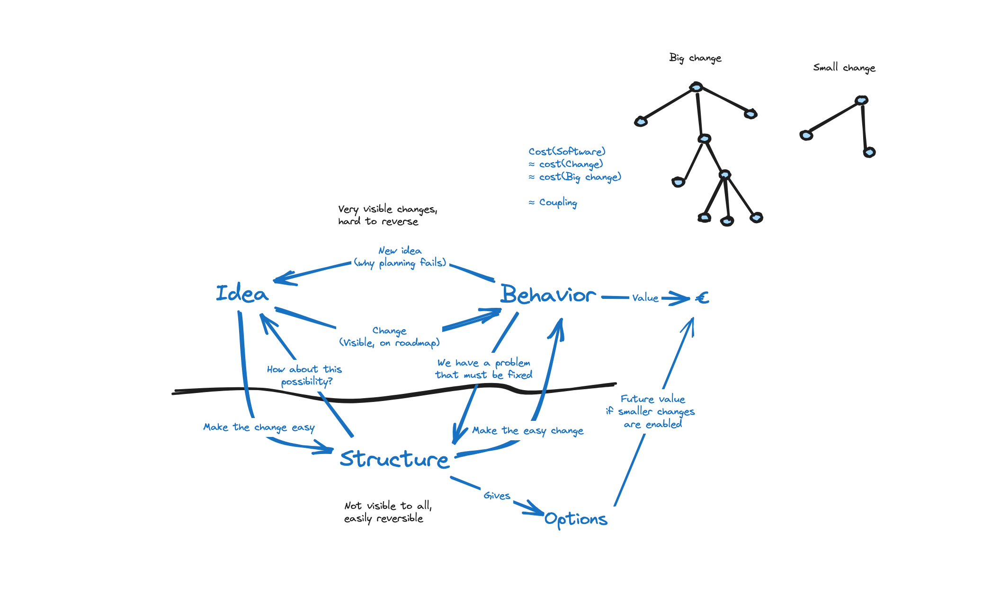

# Scaling Agile
These are my notes on how an organisation transformed from hardly being able to run a handful of digitalization projects in parallel and only creating value from them sporadically, into a fast-moving agile organization. I have observed this type of transition twice in the role of architect in two different organisations both with tens of projects or teams running in parallel. The first transition was targeting the SAFe-Framework. The second transition was a much more deliberate and tailored approach. The deliberate and tailored transition will be the main topic of these notes, but I might reference the first transition explicitly where appropriate.

# Summary
Obtaining massive improvements in speed, domain knowledge and short-term value creation is very doable. Just follow practices from "Accelerate" and implement stream aligned teams and platform teams from "Team topologies". Then make sure your teams gets a clear "mission" limited to a reasonable business domain described, while protecting them from strong internal forces that will want to deliver change tickets to the teams. The lessons here are however more subtle and deals with two separate aspects that arise from the initial success of scaling agile organisations.
* First lesson - Speed is surprisingly a substitute for direction, but it doesn´t scale vell alone.
* Second lesson - Managing the second order effects of success. Producing new assets creates risks and opportunities hiding or missing in the structure of your implementations.

# __ Work in progress __
For the rest of this post I will proceed to explain:

# Seting the context
* What we actually did to create a productive digitalization org.
    * The humble beginnings; transition from projects to teams to maintain continuity in knowledge about the asset.
    * Splitting stream aligned teams and plattform teams to leverage scale.
        * This failed at first because the applications were too tightly coupled to the and this also caused the plattform not to evolve into a capability with sufficiently self-service. The result was that we largely ended up with a 1:1 of platform and application effort. A redesign of the underlying application architecture and platform was needed.
        * The second attempt yelded a almost fully self service platform and we even put some effort into not depending too deeply on custom cloud features. Architecture is not the scope here, but we largely created separate sandboxes for each system, relying heavily on self-hosted NATS on cloud VMs to create a communication mesh that also can persist streams of data. Other cloud services are freely chosen by the teams but they are incentivised to use containers and postgres-as-a-service. Run your own VM if you need something bespoke. The result is more like a 1:10 effort in plattform and application, allowing us to scale up stream aligned teams while spending much less on creating and mantaining a plattform.
    * Leadership and scale; We eventually got to working at the transition from both bottom and top, transforming the IT department first and the rest of the 1300 person organization is about to follow.There was however significant upfront effort over multiple years to create continuous deployment, container based runtimes, git as a service, team vs project awareness and so forth. When the two first teams were established a lot of the uncertainty was eliminated. We could do this! Luckily we had massive change of mindset in large parts og management around this time. Teams were to become the new normal. Projects had proven time and again that they delivered late or not at all and when they delivered there was almost instantly the need for a new project to fix everything that the first one got wrong.

# Observations
* First lesson - Speed is surprisingly a substitute for direction, but it doesn´t scale vell alone.
    * Bees and discovery: serendipity, 20% ignores plan/bee-dance
    * Some alignment scales speed. Turning alignment to 0 or 11 creates traps of local optmization
* Second lesson - Managing the second order effects of success. Producing new assets creates risks and opportunities hiding or missing in the structure of your implementations.
    * Kent Beck — behavior and structure
    

    * Risks as second order effects of successfully creating new assets
    

    * Opportunities

# Improvements
* Places to innovate
    * The Art of Action — directed opportunism
        * Hierarchy of cascading intent
        * Institute backbrief
    * Alignment and autonomy

    
    See [Alignment and autonomy](https://github.com/acje/Alignment_autonomy) for more details

* Managing costs of transition
    * Organizational costs
    * Personal costs
